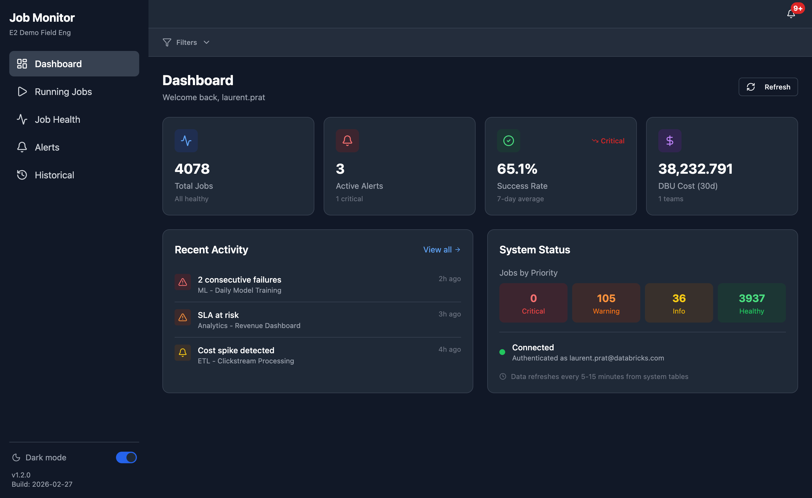
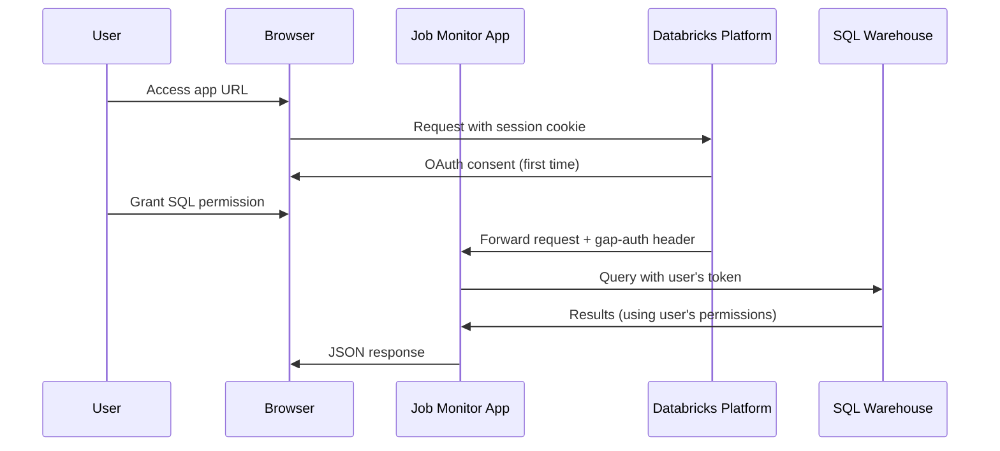
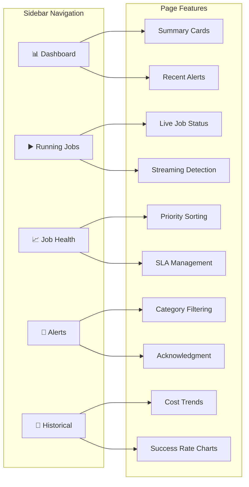
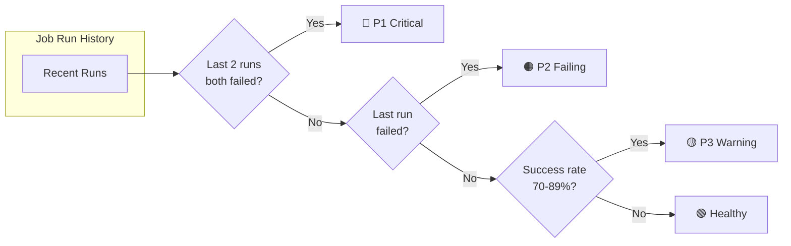
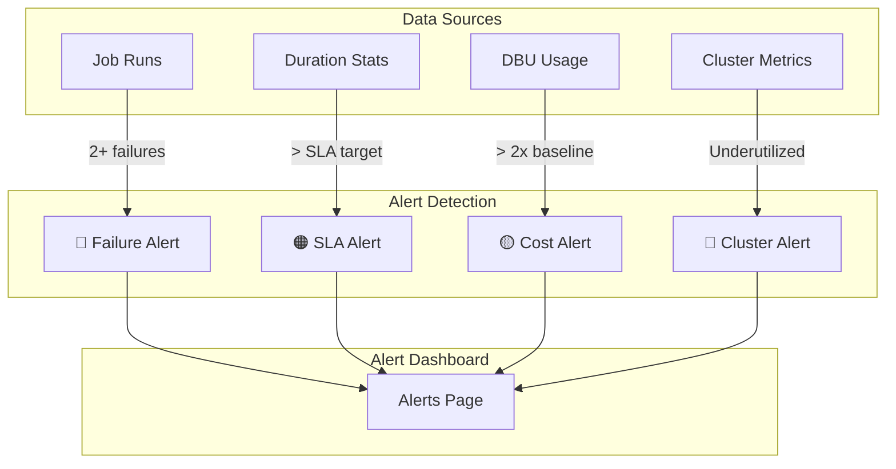
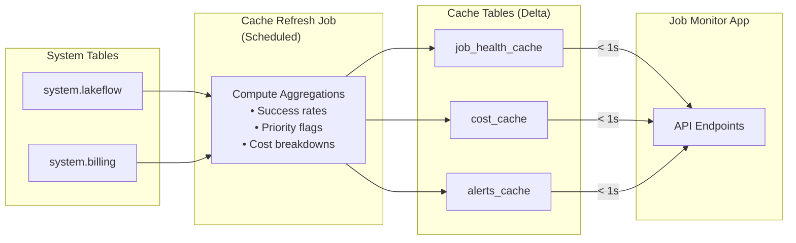
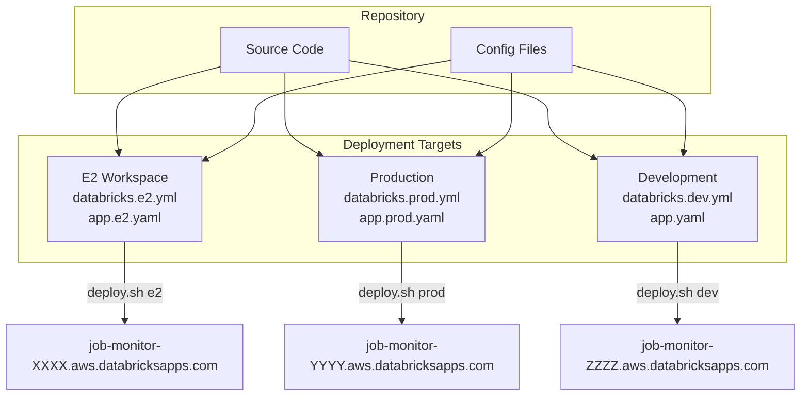
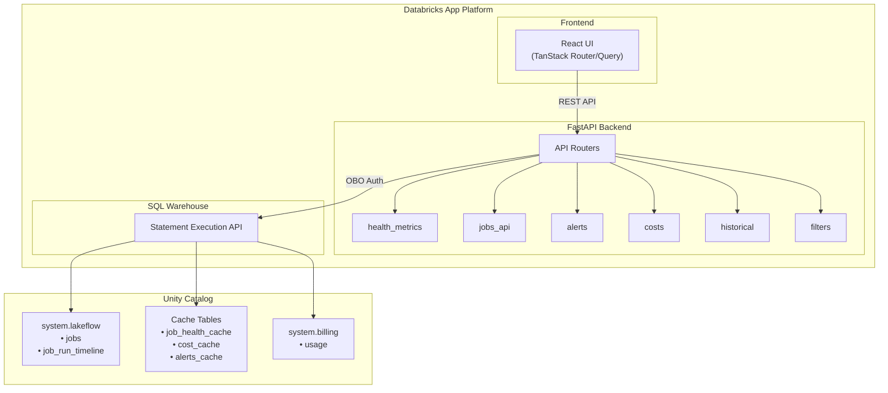
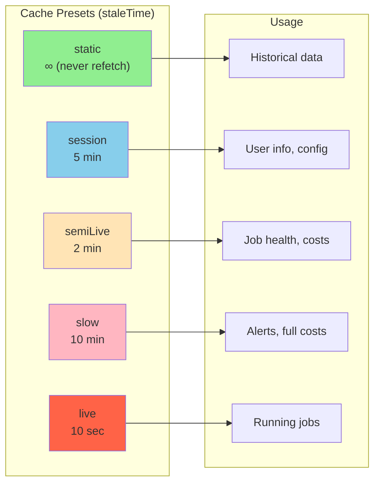

# Databricks Job Monitor

A production-ready operational monitoring dashboard for Databricks jobs, clusters, and resources. Monitor job health, track costs, receive intelligent alerts, and analyze historical trends—all from a single pane of glass.



## Table of Contents

- [Features](#features)
- [Quick Start](#quick-start)
- [Installation](#installation)
- [Configuration](#configuration)
- [Application Usage](#application-usage)
- [Monitoring Jobs](#monitoring-jobs)
- [Deployment](#deployment)
- [Developer Guide](#developer-guide)
- [Troubleshooting](#troubleshooting)
- [Tech Stack](#tech-stack)

---

## Features

### Core Capabilities

| Feature | Description |
|---------|-------------|
| **Job Health Dashboard** | Real-time job status with priority flags (P1/P2/P3) based on failure patterns |
| **Running Jobs Monitor** | Live view of executing jobs with streaming detection and duration tracking |
| **Smart Alerts** | Dynamic alerts for failures, SLA breaches, cost anomalies, and cluster issues |
| **Cost Analysis** | Per-job and per-team cost attribution with DBU breakdown by SKU |
| **Historical Trends** | Visualize cost, success rate, and failure trends with period-over-period comparison |
| **Wildcard Filtering** | Filter jobs by name patterns (e.g., `*ETL*`, `prod-*-daily`) across all pages |
| **Filter Presets** | Save and share filter combinations for quick access |

### Performance Optimizations

- **Metrics Cache**: Pre-aggregated Delta tables for sub-second dashboard loading
- **Batch API Calls**: N+1 query elimination (50 requests → 1 request)
- **Client-Side Caching**: Tiered TanStack Query caching for instant navigation
- **Table Virtualization**: Render only visible rows for 4000+ job lists
- **Route Prefetching**: Background data loading when navigating between pages
- **GZip Compression**: Automatic response compression for large payloads

---

## Quick Start

```bash
# Clone and install
git clone <repository-url>
cd databricks_job_monitoring
pip install -e ".[dev]"

# Build frontend
cd job_monitor/ui && npm install && npm run build && cd ../..

# Deploy to Databricks
databricks bundle deploy -t dev
```

---

## Installation

### Prerequisites

| Requirement | Details |
|-------------|---------|
| **Python** | 3.10+ |
| **Node.js** | 18+ (for frontend build) |
| **Databricks Workspace** | Unity Catalog enabled |
| **SQL Warehouse** | Serverless recommended |
| **Databricks CLI** | v0.200+ with authenticated profile |

### Step 1: Clone Repository

```bash
git clone <repository-url>
cd databricks_job_monitoring
```

### Step 2: Install Python Dependencies

```bash
# Using pip
pip install -e ".[dev]"

# Or using uv (faster)
uv sync
```

### Step 3: Build Frontend

```bash
cd job_monitor/ui
npm install
npm run build
cd ../..
```

### Step 4: Configure Databricks CLI

```bash
# Create or configure a profile
databricks configure --profile YOUR_PROFILE

# Verify authentication
databricks auth describe --profile YOUR_PROFILE
```

### Step 5: System Table Permissions

The app requires read access to Unity Catalog system tables. Choose one approach:

#### Option A: User OBO Authentication (Recommended)

Use **On-Behalf-Of (OBO)** to run queries with the logged-in user's permissions.



1. Add to `app.yaml`:
   ```yaml
   user_api_scopes:
     - sql
   ```

2. After deployment, enable OBO via CLI:
   ```bash
   databricks apps update job-monitor --json '{"user_api_scopes": ["sql"]}' -p YOUR_PROFILE
   ```

3. Verify:
   ```bash
   databricks apps get job-monitor -p YOUR_PROFILE
   # Look for: "effective_user_api_scopes": ["sql"]
   ```

#### Option B: Service Principal Grants

Grant permissions to the app's Service Principal (requires Account Administrator):

```sql
-- Grant system.lakeflow access (job data)
GRANT USE SCHEMA ON SCHEMA system.lakeflow TO `SERVICE_PRINCIPAL_ID`;
GRANT SELECT ON SCHEMA system.lakeflow TO `SERVICE_PRINCIPAL_ID`;

-- Grant system.billing access (cost data)
GRANT USE SCHEMA ON SCHEMA system.billing TO `SERVICE_PRINCIPAL_ID`;
GRANT SELECT ON SCHEMA system.billing TO `SERVICE_PRINCIPAL_ID`;
```

---

## Configuration

### Environment Variables

Configure in `app.yaml` or set as environment variables:

| Variable | Description | Default |
|----------|-------------|---------|
| `DATABRICKS_HOST` | Workspace URL (auto-set by platform) | - |
| `WAREHOUSE_ID` | SQL Warehouse ID for queries | **Required** |
| `CACHE_CATALOG` | Catalog for cache tables | `main` |
| `CACHE_SCHEMA` | Schema for cache tables | `job_monitor_cache` |
| `LOG_LEVEL` | Logging level | `INFO` |
| `USE_MOCK_DATA` | Enable demo mode with mock data | `false` |

### Job Tags

Tag your Databricks jobs to enable advanced features:

| Tag Key | Purpose | Example |
|---------|---------|---------|
| `team` | Team attribution for cost grouping | `data-platform` |
| `sla_minutes` | SLA target in minutes | `30` |
| `budget_monthly_dbus` | Monthly DBU budget | `500` |
| `owner` | Job owner for notifications | `jane@company.com` |
| `output_tables` | Tables for Pipeline Integrity tracking | `catalog.schema.table` |

---

## Application Usage

### Navigation

The application has five main pages accessible from the sidebar:



| Page | Icon | Purpose |
|------|------|---------|
| **Dashboard** | 📊 | Overview with summary metrics and recent activity |
| **Running Jobs** | ▶️ | Real-time view of currently executing jobs |
| **Job Health** | 📈 | Job health metrics with priority-based sorting |
| **Alerts** | 🔔 | Active alerts from all categories |
| **Historical** | 📅 | Trend charts for costs, success rates, failures |

### Dashboard

The Dashboard provides a high-level overview of your Databricks jobs ecosystem:

**Metric Cards:**
- **Total Jobs**: Count of jobs with activity in the monitoring window
- **Active Alerts**: Current alert count with critical alerts highlighted
- **Success Rate**: 7-day average success rate across all jobs
- **DBU Cost (30d)**: Total DBU consumption over the last 30 days

**System Status Panel:**
- Jobs by priority (Critical/P1, Warning/P2, Info/P3, Healthy)
- Connection status showing authentication state
- Data freshness indicator

**Recent Activity:**
- Latest 5 alerts with severity indicators
- Click any alert to navigate to the Alerts page

### Running Jobs

Monitor jobs that are currently executing:

**Features:**
- **Real-time updates**: Auto-refreshes every 30 seconds
- **State filtering**: Click cards to filter by Running/Pending/Terminating
- **Streaming detection**: Jobs matching patterns like `*stream*`, `*cdc*`, `*pipeline*` are flagged
- **Long-running alerts**: Batch jobs > 4h or streaming jobs > 24h show warning
- **Recent runs history**: 5 most recent run results (Success/Failed/Canceled)
- **Expandable rows**: Click any job to see detailed information

**Table Columns:**
| Column | Description |
|--------|-------------|
| Job Name | Name with streaming/long-running indicators |
| Recent Runs | Last 5 run results as status icons |
| State | RUNNING, PENDING, QUEUED, or TERMINATING |
| Started (UTC) | Start time in UTC |
| Duration | Time since start |
| Link | Direct link to Databricks job run |

### Job Health

Analyze job health patterns and identify problematic jobs:

**Time Windows:**
- **7 Days**: Recent health snapshot (default)
- **30 Days**: Extended view for trend analysis

**Priority System:**



| Priority | Criteria | Color |
|----------|----------|-------|
| P1 (Critical) | 2+ consecutive failures | Red |
| P2 (Failing) | Recent failure | Orange |
| P3 (Warning) | Success rate 70-89% | Yellow |
| Healthy | Success rate ≥ 90% | Green |

**Summary Cards:**
Click any card to filter the table by that priority level.

**Table Features:**
- Sortable by any column
- Search by job name
- Inline SLA editing
- Duration sparklines
- Click job name to see expanded details

### Alerts

Review and manage alerts from multiple sources:

**Alert Categories:**



| Category | Source | Examples |
|----------|--------|----------|
| **Failure** | Job run results | 2+ consecutive failures, low success rate |
| **SLA** | Duration vs target | Job exceeded SLA target duration |
| **Cost** | DBU usage | Cost spike > 2x baseline p90 |
| **Cluster** | Cluster metrics | Over-provisioned resources |

**Severity Badges:**
- **P1 Critical**: Requires immediate attention
- **P2 Warning**: Should be investigated
- **P3 Info**: Informational, may need attention

**Actions:**
- Click severity badges to filter
- Acknowledge alerts to dismiss for 24h
- "All" tab runs all 4 queries (~30s), category tabs are faster (~1-5s)

### Historical Trends

Visualize trends with period-over-period comparison:

**Tabs:**
1. **Cost Trends**: DBU consumption over time
2. **Success Rate**: Job success percentage
3. **Failures**: Count of failed runs

**Chart Features:**
- Solid line: Current period
- Dashed line: Previous period (same duration)
- Hover for exact values
- Auto-granularity (hourly/daily/weekly based on range)

**Summary Cards:**
- Current total value
- Previous period comparison
- Change percentage with trend indicator

### Global Filters

The filter panel (accessible from header) applies across all pages:

**Filter Options:**
1. **Workspace**: Filter by Databricks workspace (for multi-workspace deployments)
2. **Time Range**: 7d, 30d, 90d, or custom date range
3. **Team**: Filter by team tag
4. **Job Name Patterns**: Wildcard filters like `*ETL*`, `prod-*`

**Filter Presets:**
- Save current filters as a preset
- Load presets with one click
- Edit existing presets
- Share presets across team (stored in Delta table)

**Wildcard Pattern Examples:**
| Pattern | Matches |
|---------|---------|
| `*ETL*` | Any job with "ETL" in the name |
| `prod-*` | Jobs starting with "prod-" |
| `*-daily` | Jobs ending with "-daily" |
| `*DQ*,*quality*` | Multiple patterns (comma-separated) |

---

## Monitoring Jobs

The application includes a background job that pre-aggregates metrics for optimal dashboard performance.

### Cache Refresh Job

**Purpose:** Pre-compute expensive aggregations from system tables into Delta tables.



**Performance Impact:**
| Query Type | Without Cache | With Cache |
|------------|---------------|------------|
| Health Metrics | 10-16s | <1s |
| Cost Summary | 30-40s | <1s |
| Alerts | 15-30s | <1s |

**Cache Tables Created:**

| Table | Contents |
|-------|----------|
| `{catalog}.{schema}.job_health_cache` | Success rates, priorities, duration stats |
| `{catalog}.{schema}.cost_cache` | Per-job costs with SKU breakdown |
| `{catalog}.{schema}.alerts_cache` | Pre-computed alert conditions |

**What the Job Computes:**

1. **Job Health Cache:**
   - Success rates (7-day and 30-day windows)
   - Priority flags (P1/P2/P3) based on failure patterns
   - Consecutive failure detection
   - Retry counts
   - Duration statistics (median, p90, avg, max)

2. **Cost Cache:**
   - Total DBUs per job (30-day)
   - 7-day period comparison for trend calculation
   - SKU breakdown per job
   - P90 baseline for anomaly detection
   - Cost spike flags (>2x baseline)

3. **Alerts Cache:**
   - Failure alerts from consecutive failure detection
   - Cost spike alerts from anomaly detection
   - Pre-computed severity levels

### Deploying the Cache Job

The job is deployed automatically with the bundle:

```bash
databricks bundle deploy -t e2
```

**Recommended Schedules:**

| Use Case | Cron Expression | Interval |
|----------|-----------------|----------|
| Real-time ops | `0 */5 * * * ?` | Every 5 minutes |
| Standard (default) | `0 */15 * * * ?` | Every 15 minutes |
| Cost-conscious | `0 */30 * * * ?` | Every 30 minutes |

**Override Schedule:**
```bash
databricks bundle deploy -t e2 --var="cache_refresh_cron=0 */30 * * * ?"
```

**Run Manually:**
```bash
databricks bundle run refresh-metrics-cache -t e2
```

**Monitor Job:**
```bash
# View recent runs
databricks jobs list-runs --job-id JOB_ID --limit 5 -p YOUR_PROFILE

# Check in UI: Workflows → job-monitor-refresh-cache → Runs
```

### Cache Status API

Check cache availability:

```bash
curl https://YOUR_APP_URL/api/cache/status
```

Response:
```json
{
  "available": true,
  "fresh": true,
  "refreshed_at": "2024-01-15T10:30:00Z",
  "cache_enabled": true
}
```

### Required Permissions for Cache

The cache refresh job needs permissions to write to the cache catalog/schema:

```sql
-- Option 1: Create dedicated catalog
CREATE CATALOG IF NOT EXISTS job_monitor;
GRANT ALL PRIVILEGES ON CATALOG job_monitor TO `user@company.com`;

-- Option 2: Use existing catalog
-- Update config.yaml to use your catalog (e.g., "main")

-- For OBO users to read cache
GRANT USE CATALOG ON CATALOG job_monitor TO `account users`;
GRANT USE SCHEMA ON SCHEMA job_monitor.cache TO `account users`;
GRANT SELECT ON SCHEMA job_monitor.cache TO `account users`;
```

---

## Deployment

### Using Databricks Asset Bundles (DABs)

1. **Update target configuration** in `databricks.yml`:
   ```yaml
   targets:
     dev:
       mode: development
       workspace:
         profile: YOUR_PROFILE
       variables:
         warehouse_id: "YOUR_WAREHOUSE_ID"
   ```

2. **Build frontend:**
   ```bash
   cd job_monitor/ui && npm run build && cd ../..
   ```

3. **Deploy:**
   ```bash
   databricks bundle deploy -t dev
   ```

4. **Enable OBO** (required after first deploy):
   ```bash
   databricks apps update job-monitor --json '{"user_api_scopes": ["sql"]}' -p YOUR_PROFILE
   ```

5. **Get app URL:**
   ```bash
   databricks apps get job-monitor -p YOUR_PROFILE
   ```

### Using deploy.sh Script

For multi-environment deployments:

```bash
# E2 workspace
./deploy.sh e2

# Production (DEMO WEST)
./deploy.sh prod

# Development
./deploy.sh dev
```

### Multi-Workspace Deployment



Each target has separate config files:

| Target | Bundle Config | App Config |
|--------|--------------|------------|
| e2 | `databricks.e2.yml` | `app.e2.yaml` |
| prod | `databricks.prod.yml` | `app.prod.yaml` |
| dev | `databricks.dev.yml` | `app.yaml` |

---

## Developer Guide

### Local Development

```bash
# Terminal 1: Backend with mock data
export USE_MOCK_DATA=true
uvicorn job_monitor.backend.app:app --reload --port 8000

# Terminal 2: Frontend with hot reload
cd job_monitor/ui
npm run dev
```

Frontend runs at `http://localhost:5173`, proxies API calls to backend at `http://localhost:8000`.

### Running Tests

```bash
pytest tests/
```

### Architecture



### Performance Optimizations

The application includes numerous optimizations for production performance:

#### Backend Optimizations

| Optimization | Location | Impact |
|-------------|----------|--------|
| Health Summary Endpoint | `health_metrics.py` | 86x smaller payload |
| Batch Job History | `jobs_api.py` | 50 requests → 1 request |
| Response Caching | Multiple routers | Configurable TTL per endpoint |
| Selective Alert Queries | `alerts.py` | Only run requested categories |
| Cost Summary Skip Teams | `cost.py` | 37s → 7.8s with `include_teams=false` |

#### Frontend Optimizations

| Optimization | Location | Impact |
|-------------|----------|--------|
| Query Key Deduplication | `query-config.ts` | Single `/api/me` call |
| Tiered Cache Presets | `query-config.ts` | Different TTLs per data type |
| Default Failure Tab | `alerts.tsx` | 30s → 5s initial load |
| Infinite Query Pagination | Multiple pages | Load more on demand |
| Table Virtualization | `job-health-table.tsx` | Only render visible rows (4000+ jobs) |
| Route Prefetching | `routeTree.gen.tsx` | Background data loading on navigation |
| Alert Cache Sharing | `alert-badge.tsx` | Single cache for badge + table |

#### TanStack Query Presets



```typescript
// query-config.ts
export const queryPresets = {
  static: { staleTime: Infinity, gcTime: 60 * 60 * 1000 },      // Never refetch
  session: { staleTime: 5 * 60 * 1000, gcTime: 30 * 60 * 1000 }, // User session
  semiLive: { staleTime: 2 * 60 * 1000, gcTime: 10 * 60 * 1000 }, // System tables
  live: { staleTime: 10 * 1000, gcTime: 60 * 1000 },            // Active jobs
  slow: { staleTime: 10 * 60 * 1000, gcTime: 30 * 60 * 1000 },  // Expensive queries
}
```

#### Watch Points for Developers

1. **OBO Authentication**: All routers querying system tables MUST use `get_ws_prefer_user` (not `get_ws`)
   - `get_ws` → Service Principal auth → limited permissions
   - `get_ws_prefer_user` → OBO → user's permissions

2. **Query Key Consistency**: Use `queryKeys.user.current()` for user queries to enable cache sharing

3. **Slow Endpoints**: Always use `queryPresets.slow` for expensive queries (alerts, costs)

4. **Result State Casing**: System tables use `SUCCEEDED` (not `SUCCESS`) for result_state

5. **Workspace Filtering**: All endpoints should support `workspace_id` parameter for multi-workspace deployments

### API Endpoints Reference

| Endpoint | Method | Description |
|----------|--------|-------------|
| **Health** |||
| `/api/health` | GET | App health check |
| `/api/me` | GET | Current authenticated user |
| `/api/cache/status` | GET | Cache availability and freshness |
| **Job Health** |||
| `/api/health-metrics` | GET | Paginated job health list |
| `/api/health-metrics/summary` | GET | Lightweight counts only |
| `/api/health-metrics/{job_id}/details` | GET | Expanded job details |
| **Running Jobs** |||
| `/api/jobs-api/active` | GET | Currently running jobs |
| `/api/jobs-api/runs/{job_id}` | GET | Run history for a job |
| `/api/jobs-api/runs/batch` | POST | Batch fetch history for multiple jobs |
| **Alerts** |||
| `/api/alerts` | GET | Alerts with optional category filter |
| `/api/alerts/{id}/acknowledge` | POST | Acknowledge alert (24h TTL) |
| **Costs** |||
| `/api/costs/summary` | GET | Cost summary (use `include_teams=false` for speed) |
| `/api/historical/costs` | GET | Historical cost trends |
| **Historical** |||
| `/api/historical/success-rate` | GET | Success rate trends |
| `/api/historical/sla-breaches` | GET | Failure count trends |
| **Filters** |||
| `/api/filters/presets` | GET/POST | List or create filter presets |
| `/api/filters/presets/{id}` | PUT/DELETE | Update or delete preset |

---

## Troubleshooting

### Common Issues

#### Permission Errors (403)

**Symptom**: API returns "INSUFFICIENT_PERMISSIONS"

**Solution**:
1. Verify OBO is enabled:
   ```bash
   databricks apps get job-monitor -p YOUR_PROFILE
   # Check for: "effective_user_api_scopes": ["sql"]
   ```
2. Re-enable OBO if needed:
   ```bash
   databricks apps update job-monitor --json '{"user_api_scopes": ["sql"]}' -p YOUR_PROFILE
   ```
3. Clear browser cache and re-login to trigger OAuth consent

#### Dashboard Shows 0 / Loading

**Symptom**: Metrics show 0 or stuck loading

**Solution**:
1. Check app logs: `https://YOUR_APP_URL/logz`
2. Verify warehouse ID matches an active warehouse
3. Check cache status: `curl https://YOUR_APP_URL/api/cache/status`
4. Run cache refresh job if cache is stale

#### Slow Page Loads (>10s)

**Symptom**: Pages take 10-30+ seconds to load

**Solution**:
1. Verify cache is enabled and fresh
2. Check if using category filters on Alerts page (defaults to Failure which is fast)
3. Review network tab for which endpoints are slow
4. Consider deploying cache refresh job if not running

#### App Logs Location

- **E2**: `https://job-monitor-XXXX.aws.databricksapps.com/logz`
- **From CLI**: `databricks apps logs job-monitor -p YOUR_PROFILE`

### Debug Headers

Check app logs for authentication status:
- `gap-auth: user@email.com` → OBO working, using user credentials
- No `gap-auth` header → Using Service Principal credentials

---

## Tech Stack

| Layer | Technology |
|-------|------------|
| **Backend** | FastAPI, Databricks SDK, Pydantic, APScheduler |
| **Frontend** | React 18, TypeScript, TanStack Router/Query, Tailwind CSS, Recharts |
| **Caching** | Server: Delta tables, Client: TanStack Query |
| **Deployment** | Databricks Apps via Asset Bundles (DABs) |
| **Data Sources** | Unity Catalog system tables (lakeflow, billing) |

---

## License

MIT

---

## Version History

| Version | Date | Highlights |
|---------|------|------------|
| 1.2.1 | 2026-02-27 | Table virtualization, route prefetching, alert cache optimization |
| 1.2.0 | 2026-02-26 | Filter presets caching, cache warm-up, UI polish |
| 1.1.0 | 2026-02-26 | Wildcard filtering, preset edit mode |
| 1.0.0 | 2026-02-25 | Initial release with multi-workspace support |
