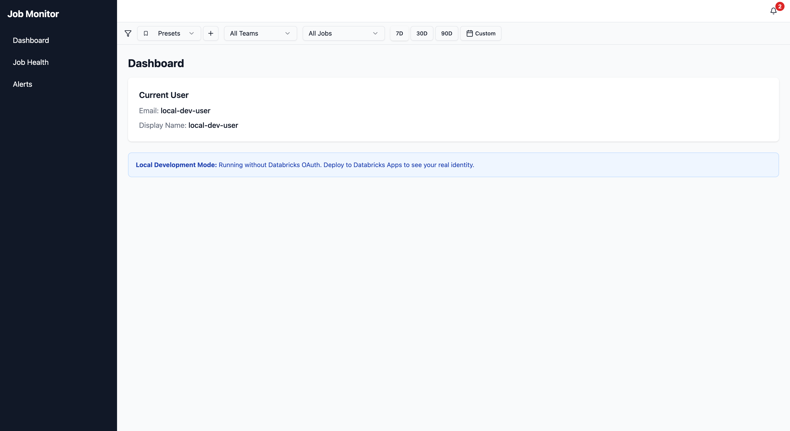

# Job Monitor

Databricks Job Monitoring Framework - A real-time operational monitoring dashboard for Databricks jobs, clusters, and resources.



## Features

- **Job Health Dashboard**: View job execution status with priority flags (P1/P2/P3)
- **SLA Tracking**: Monitor running jobs against configurable SLA targets
- **Cost Analysis**: Per-job and per-team cost attribution with DBU breakdown by SKU
- **Smart Alerts**: Dynamic alert generation for failures, SLA breaches, cost anomalies
- **Anomaly Detection**: Identify cost spikes (>2x p90 baseline) and over-provisioned clusters
- **Metrics Cache**: Pre-aggregated Delta tables for sub-second dashboard loading
- **Client-Side Caching**: Tiered TanStack Query caching for instant page navigation
- **Mock Data Mode**: Demo-ready fallback when system tables aren't accessible

> **For Developers**: See [DEVELOPER.md](DEVELOPER.md) for detailed development setup, architecture, and contribution guidelines.

## Architecture

```
┌─────────────────────────────────────────────────────────────────────┐
│                      Databricks App Platform                        │
├─────────────────────────────────────────────────────────────────────┤
│                                                                     │
│  ┌─────────────┐     ┌─────────────────────────────────────────┐   │
│  │   React UI  │────▶│          FastAPI Backend               │   │
│  │  (TanStack) │     │                                         │   │
│  └─────────────┘     │  /api/health-metrics                    │   │
│                      │  /api/alerts                            │   │
│                      │  /api/costs/summary                     │   │
│                      │  /api/jobs                              │   │
│                      └───────────────┬─────────────────────────┘   │
│                                      │                             │
│                      ┌───────────────▼─────────────────────────┐   │
│                      │        SQL Warehouse                    │   │
│                      └───────────────┬─────────────────────────┘   │
│                                      │                             │
└──────────────────────────────────────┼─────────────────────────────┘
                                       │
           ┌───────────────────────────┼───────────────────────────┐
           │                           │                           │
           ▼                           ▼                           ▼
┌─────────────────────┐  ┌─────────────────────┐  ┌─────────────────────┐
│  system.lakeflow    │  │  system.lakeflow    │  │  system.billing     │
│       .jobs         │  │  .job_run_timeline  │  │       .usage        │
├─────────────────────┤  ├─────────────────────┤  ├─────────────────────┤
│ Job metadata (SCD2) │  │ Job run history,    │  │ DBU consumption     │
│ - job_id, name      │  │ durations, states   │  │ per job/SKU         │
│ - workspace_id      │  │ - result_state      │  │ - usage_quantity    │
│ - change_time       │  │ - run_duration_sec  │  │ - sku_name          │
│ - delete_time       │  │ - period_start_time │  │ - usage_date        │
└─────────────────────┘  └─────────────────────┘  └─────────────────────┘
```

## Prerequisites

### 1. Databricks Workspace

- Unity Catalog enabled workspace
- SQL Warehouse (Serverless recommended)
- Databricks CLI configured with authentication profile

### 2. System Table Permissions

The app requires read access to Unity Catalog system tables. There are two approaches:

#### Option A: User OBO Authentication (Recommended)

Use **On-Behalf-Of (OBO)** authentication to run queries with the logged-in user's permissions. This is the recommended approach because users typically already have system table access.

1. **Configure app.yaml with user_api_scopes**:

```yaml
user_api_scopes:
  - sql
```

2. **Enable OBO via CLI** (required after app creation):

```bash
databricks apps update job-monitor --json '{"user_api_scopes": ["sql"]}' --profile YOUR_PROFILE
```

3. **Verify OBO is enabled**:

```bash
databricks apps get job-monitor --profile YOUR_PROFILE
# Look for "effective_user_api_scopes": ["sql"]
```

> **Note**: Users will see an OAuth consent dialog on first access. The app then uses the user's existing permissions for all system table queries.

#### Option B: Service Principal Grants

Grant direct permissions to the app's Service Principal. Requires an **Account Administrator**.

##### Required System Tables

| Schema | Table | Purpose |
|--------|-------|---------|
| `system.lakeflow` | `jobs` | Job metadata (name, workspace, etc.) |
| `system.lakeflow` | `job_run_timeline` | Job run history, durations, result states |
| `system.billing` | `usage` | DBU consumption for cost attribution |

##### Grant SQL Commands

```sql
-- Replace SERVICE_PRINCIPAL_ID with the app's service principal application ID
-- You can find this in the app settings or Unity Catalog permissions

-- Grant access to system.lakeflow (job run data)
GRANT USE SCHEMA ON SCHEMA system.lakeflow TO `SERVICE_PRINCIPAL_ID`;
GRANT SELECT ON SCHEMA system.lakeflow TO `SERVICE_PRINCIPAL_ID`;

-- Grant access to system.billing (cost data)
GRANT USE SCHEMA ON SCHEMA system.billing TO `SERVICE_PRINCIPAL_ID`;
GRANT SELECT ON SCHEMA system.billing TO `SERVICE_PRINCIPAL_ID`;
```

> **Note**: These grants must be executed by an Account Administrator (member of "account admins" or metastore admin). Workspace administrators alone cannot grant access to system catalog tables.

##### Verifying Permissions

After grants are applied, verify access:

```sql
-- Test lakeflow access
SELECT * FROM system.lakeflow.jobs LIMIT 1;
SELECT * FROM system.lakeflow.job_run_timeline LIMIT 1;

-- Test billing access
SELECT * FROM system.billing.usage LIMIT 1;
```

### 3. Mock Data Fallback

If system table permissions are not available (e.g., for demos), the app automatically falls back to realistic mock data. You can also explicitly enable mock mode:

```yaml
# In app.yaml
env:
  - name: USE_MOCK_DATA
    value: "true"
```

## Installation

### Clone the Repository

```bash
git clone <repository-url>
cd databricks_job_monitoring
```

### Install Python Dependencies

```bash
# Using pip
pip install -e ".[dev]"

# Or using uv (recommended)
uv sync
```

### Install Frontend Dependencies

```bash
cd job_monitor/ui
npm install
npm run build
cd ../..
```

### Configure Databricks CLI Profile

```bash
# Configure authentication profile
databricks configure --profile YOUR_PROFILE

# Verify authentication
databricks auth describe --profile YOUR_PROFILE
```

## Configuration

### Central Configuration File

All settings are centralized in `job_monitor/config.yaml`. This file is used by both the app and the cache refresh job.

```yaml
# job_monitor/config.yaml
cache:
  catalog: "job_monitor"      # Unity Catalog for cache tables
  schema: "cache"             # Schema for cache tables
  refresh_cron: "0 */10 * * * ?"  # Refresh schedule (every 10 min)
  enabled: true               # Set to false to bypass cache

warehouse_id: ""              # SQL Warehouse ID (usually set via env var)
dbu_rate: 0.0                 # DBU to dollar conversion rate

tags:
  sla: "sla_minutes"          # Job tag key for SLA target
  team: "team"                # Job tag key for team attribution
  owner: "owner"              # Job tag key for owner
  budget: "budget_monthly_dbus"  # Job tag key for monthly DBU budget
```

### Environment Variables

Environment variables override `config.yaml` values. Set these in `app.yaml`:

| Variable | Description | Default |
|----------|-------------|---------|
| `DATABRICKS_HOST` | Workspace URL (auto-set by platform) | - |
| `WAREHOUSE_ID` | SQL Warehouse ID for queries | Required |
| `USE_MOCK_DATA` | Enable mock data mode | `false` |
| `LOG_LEVEL` | Logging level (DEBUG, INFO, etc.) | `INFO` |
| `DBU_RATE` | DBU to dollar conversion rate | `0.0` |
| `CACHE_CATALOG` | Catalog for cache tables | `job_monitor` |
| `CACHE_SCHEMA` | Schema for cache tables | `cache` |
| `USE_CACHE` | Enable cache-first queries | `true` |

### Metrics Cache

The app uses pre-aggregated Delta tables for fast dashboard loading (<1 second vs 10-30 seconds with live queries).

#### Required Permissions for Cache

The cache refresh job needs permissions to create/write to the cache catalog and schema. An administrator must:

1. **Create the catalog** (if it doesn't exist):
   ```sql
   CREATE CATALOG IF NOT EXISTS job_monitor;
   ```

2. **Grant permissions to the user/service principal** running the cache refresh job:
   ```sql
   -- Grant catalog usage
   GRANT USE CATALOG ON CATALOG job_monitor TO `user@company.com`;

   -- Grant schema creation and usage
   GRANT CREATE SCHEMA ON CATALOG job_monitor TO `user@company.com`;
   GRANT USE SCHEMA ON CATALOG job_monitor TO `user@company.com`;

   -- Or for full ownership (recommended for the job runner)
   GRANT ALL PRIVILEGES ON CATALOG job_monitor TO `user@company.com`;
   ```

3. **Alternative: Use an existing catalog** where you have permissions:
   Update `job_monitor/config.yaml`:
   ```yaml
   cache:
     catalog: "your_catalog"  # e.g., "main" or your personal catalog
     schema: "job_monitor_cache"
   ```

> **Note**: The `CREATE CATALOG` permission requires metastore admin privileges. If you cannot create a new catalog, use an existing catalog where you have schema creation rights.

#### Cache Tables

| Table | Contents |
|-------|----------|
| `{catalog}.{schema}.job_health_cache` | Job success rates, priorities, duration stats |
| `{catalog}.{schema}.cost_cache` | Cost data by job with SKU breakdown |
| `{catalog}.{schema}.alerts_cache` | Pre-computed alert conditions |

### Databricks Jobs

The project includes background jobs deployed alongside the app via DABs.

#### Jobs Overview

| Job | Name | Purpose | Default Schedule |
|-----|------|---------|------------------|
| `refresh-metrics-cache` | `job-monitor-refresh-cache` | Pre-aggregate metrics from system tables into Delta cache tables | Every 15 minutes |

#### Cache Refresh Job

**Purpose**: Pre-computes expensive aggregations from system tables into Delta tables, reducing dashboard load times from 10-30 seconds to <1 second.

**What it computes**:
- Job health metrics (success rates, priorities, consecutive failures)
- Cost data by job and team with SKU breakdown
- Pre-computed alert conditions

**Cluster configuration**: Single-node `i3.xlarge` (cost-optimized for aggregation workloads)

**Recommended schedules**:

| Use Case | Cron Expression | Interval |
|----------|-----------------|----------|
| Real-time ops | `0 */5 * * * ?` | Every 5 minutes |
| Standard monitoring | `0 */15 * * * ?` | Every 15 minutes (default) |
| Cost-conscious | `0 */30 * * * ?` | Every 30 minutes |
| Hourly reporting | `0 0 * * * ?` | Every hour |

**Run manually**:
```bash
databricks bundle run refresh-metrics-cache -t e2
```

**Override schedule at deploy time**:
```bash
databricks bundle deploy -t e2 --var="cache_refresh_cron=0 */30 * * * ?"
```

**Monitor job runs**:
```bash
# View recent runs
databricks jobs list-runs --job-id JOB_ID --limit 5 -p YOUR_PROFILE

# Check in Databricks UI
# Workflows → job-monitor-refresh-cache → Runs
```

#### Check Cache Status

```bash
curl https://YOUR_APP_URL/api/cache/status
```

Returns:
```json
{
  "available": true,
  "fresh": true,
  "refreshed_at": "2024-01-15T10:30:00Z",
  "cache_enabled": true
}
```

### Job Tags for Monitoring Features

Tag your Databricks jobs to enable advanced monitoring features:

| Tag Key | Description | Example Value |
|---------|-------------|---------------|
| `team` | Team attribution for cost grouping | `data-platform` |
| `sla_minutes` | SLA target in minutes | `30` |
| `budget_monthly_dbus` | Monthly DBU budget | `500` |
| `owner` | Job owner for notifications | `jane.doe@company.com` |
| `output_tables` | Tables written by job (for Pipeline Integrity) | `catalog.schema.table1,catalog.schema.table2` |

```python
# Example: Setting job tags via SDK
job_settings = {
    "name": "My ETL Job",
    "tags": {
        "team": "data-platform",
        "sla_minutes": "30",
        "budget_monthly_dbus": "500",
        "output_tables": "main.sales.orders,main.sales.customers"
    },
    # ... other settings
}
```

#### Pipeline Integrity Tracking

The `output_tables` tag enables **Pipeline Integrity** monitoring for jobs that write to Delta tables:

- **Row Count Deltas**: Compares current row counts against a 7-day baseline. Alerts if counts deviate significantly (e.g., table suddenly has 50% fewer rows).
- **Schema Drift Detection**: Detects when table schemas change unexpectedly (columns added/removed/modified).

**How to configure:**

1. Go to **Databricks → Workflows → Select job → Edit**
2. Add a tag with key `output_tables`
3. Value is a comma-separated list of fully-qualified table names

```
output_tables = main.sales.orders,main.sales.customers
```

> **Note**: This is optional. Jobs that don't write to tables or don't need data quality tracking can safely skip this configuration.

## Deployment

### Using Databricks Asset Bundles (DABs)

1. **Update `databricks.yml`** with your workspace profile and warehouse ID:

```yaml
targets:
  dev:
    mode: development
    default: true
    workspace:
      profile: YOUR_PROFILE
    variables:
      warehouse_id: "YOUR_WAREHOUSE_ID"
```

2. **Build the frontend**:

```bash
cd job_monitor/ui
npm run build
cd ../..
```

3. **Deploy the bundle**:

```bash
databricks bundle deploy -t dev
```

4. **Get the app URL**:

```bash
databricks apps get job-monitor --profile YOUR_PROFILE
```

### Manual Deployment

```bash
# Deploy app to workspace
databricks apps deploy job-monitor \
  --profile YOUR_PROFILE \
  --source-code-path /Workspace/Users/your.email@company.com/.bundle/job-monitor/dev/files
```

## Development

For detailed development instructions, see [DEVELOPER.md](DEVELOPER.md).

### Quick Start

```bash
# Backend (with mock data for local dev)
export USE_MOCK_DATA=true
uvicorn job_monitor.backend.app:app --reload --port 8000

# Frontend (in another terminal)
cd job_monitor/ui
npm run dev
```

### Running Tests

```bash
pytest tests/
```

### API Endpoints

| Endpoint | Method | Description |
|----------|--------|-------------|
| `/api/me` | GET | Current authenticated user info |
| `/api/health` | GET | App health check |
| `/api/cache/status` | GET | Cache availability and freshness |
| **Job Health** |||
| `/api/health-metrics` | GET | Job health summary with priorities |
| `/api/health-metrics/{job_id}/duration` | GET | Duration statistics for a job |
| `/api/health-metrics/{job_id}/details` | GET | Expanded job details |
| **Alerts** |||
| `/api/alerts` | GET | Generated alerts from all sources |
| `/api/alerts/{id}/acknowledge` | POST | Acknowledge an alert (24h TTL) |
| **Costs** |||
| `/api/costs/summary` | GET | Cost summary with job/team breakdown |
| `/api/costs/by-team` | GET | Costs grouped by team tag |
| `/api/costs/anomalies` | GET | Cost spikes and zombie jobs |
| **Historical** |||
| `/api/historical/costs` | GET | Historical cost trends |
| `/api/historical/success-rate` | GET | Historical success rate trends |
| `/api/historical/sla-breaches` | GET | Historical SLA breach data |
| **Jobs** |||
| `/api/jobs` | GET | Job list from system tables |
| `/api/jobs-api/list` | GET | Jobs via Databricks Jobs API |
| `/api/jobs-api/active` | GET | Currently running jobs |
| `/api/jobs-api/runs/{job_id}` | GET | Run history for a job |
| `/api/job-tags/{job_id}/tags` | GET | Tags for a specific job |
| **Pipeline Integrity** |||
| `/api/pipeline/{job_id}/row-counts` | GET | Row count deltas for output tables |
| `/api/pipeline/{job_id}/schema-drift` | GET | Schema drift detection |
| **Cluster Metrics** |||
| `/api/cluster-metrics/{job_id}` | GET | Cluster utilization statistics |
| **Filter Presets** |||
| `/api/filters/presets` | GET | List saved filter presets |
| `/api/filters/presets` | POST | Create a filter preset |
| `/api/filters/presets/{id}` | PUT | Update a filter preset |
| `/api/filters/presets/{id}` | DELETE | Delete a filter preset |

## Troubleshooting

### Permission Errors

**Symptom**: API returns 403 or "INSUFFICIENT_PERMISSIONS" error

**Solution**:
1. Check that system table grants have been applied by an Account Administrator
2. Verify grants with `SHOW GRANTS ON SCHEMA system.lakeflow`
3. Enable mock data mode for demos: `USE_MOCK_DATA=true`

### SQL Warehouse Not Starting

**Symptom**: Queries timeout or return connection errors

**Solution**:
1. Start the warehouse: `databricks warehouses start WAREHOUSE_ID --profile YOUR_PROFILE`
2. Check warehouse state: `databricks warehouses get WAREHOUSE_ID --profile YOUR_PROFILE`
3. Consider using a warehouse without auto-stop for production

### App Not Loading Data

**Symptom**: Dashboard shows empty or "loading" state

**Solution**:
1. Check app logs: Visit `https://YOUR_APP_URL/logz`
2. Verify warehouse ID in app.yaml matches an active warehouse
3. Test SQL queries directly in Databricks SQL Editor

### Authentication Issues

**Symptom**: 401 Unauthorized or SDK initialization errors

**Solution**:
1. Verify Databricks CLI profile: `databricks auth describe --profile YOUR_PROFILE`
2. Re-authenticate: `databricks auth login --profile YOUR_PROFILE`
3. Check that the app service principal has workspace access

### OBO Not Working

**Symptom**: App uses SP credentials instead of user credentials, queries fail with permission errors

**Solution**:
1. Verify `user_api_scopes` in app.yaml contains `["sql"]`
2. Run CLI update (required after app creation):
   ```bash
   databricks apps update job-monitor --json '{"user_api_scopes": ["sql"]}' --profile YOUR_PROFILE
   ```
3. Check effective scopes:
   ```bash
   databricks apps get job-monitor --profile YOUR_PROFILE
   # Look for: "effective_user_api_scopes": ["sql"]
   ```
4. Clear browser cache and re-login to trigger OAuth consent
5. Check app logs for `gap-auth` header presence (shows authenticated user email)

### Cache Not Available

**Symptom**: Dashboard loads slowly, `/api/cache/status` shows `"available": false`

**Solution**:
1. Run the cache refresh job manually:
   ```bash
   databricks bundle run refresh-metrics-cache -t e2
   ```
2. Verify the job completed successfully in the Databricks Jobs UI
3. Check that the cache catalog/schema exist:
   ```sql
   SHOW TABLES IN job_monitor.cache;
   ```
4. Verify the app has permission to read cache tables

### Cache Data is Stale

**Symptom**: `/api/cache/status` shows `"fresh": false`

**Solution**:
1. Check if the refresh job is running on schedule in Databricks Jobs UI
2. Verify the job schedule in `job_monitor/config.yaml`:
   ```yaml
   cache:
     refresh_cron: "0 */10 * * * ?"  # Every 10 minutes
   ```
3. Run the job manually to refresh immediately:
   ```bash
   databricks bundle run refresh-metrics-cache -t e2
   ```

## Tech Stack

- **Backend**: FastAPI + Databricks SDK + Pydantic + APScheduler
- **Frontend**: React 18 + TypeScript + TanStack (Router, Query) + Tailwind CSS + Recharts
- **Caching**: Two-tier strategy:
  - **Server-side**: Pre-aggregated Delta tables refreshed every 10 minutes
  - **Client-side**: TanStack Query with tiered presets (static/semiLive/live/session)
- **Deployment**: Databricks Apps via Asset Bundles (DABs)

## Documentation

- [README.md](README.md) - This file (user guide, installation, deployment)
- [DEVELOPER.md](DEVELOPER.md) - Developer guide (local setup, architecture, contributing)

## License

MIT
