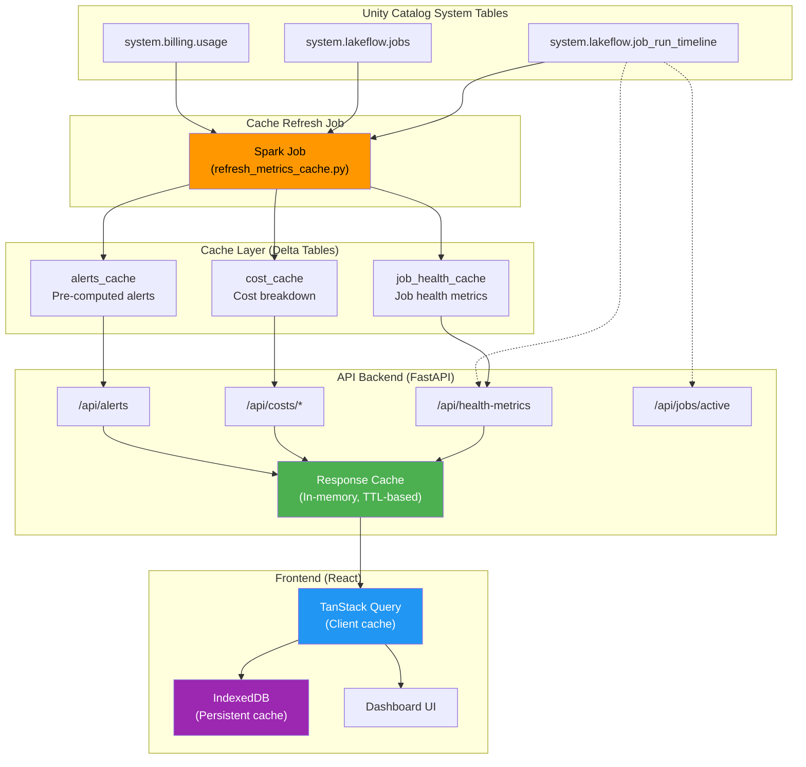
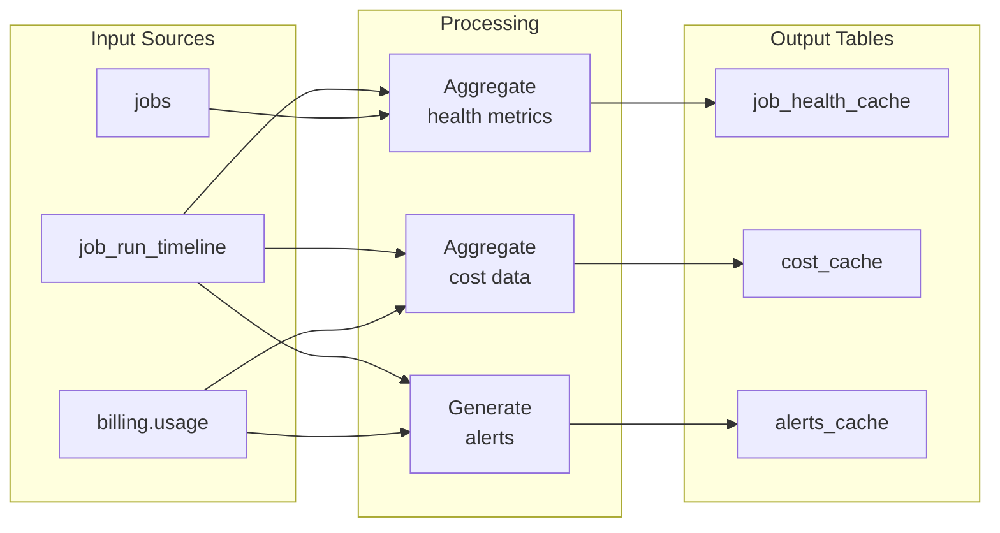
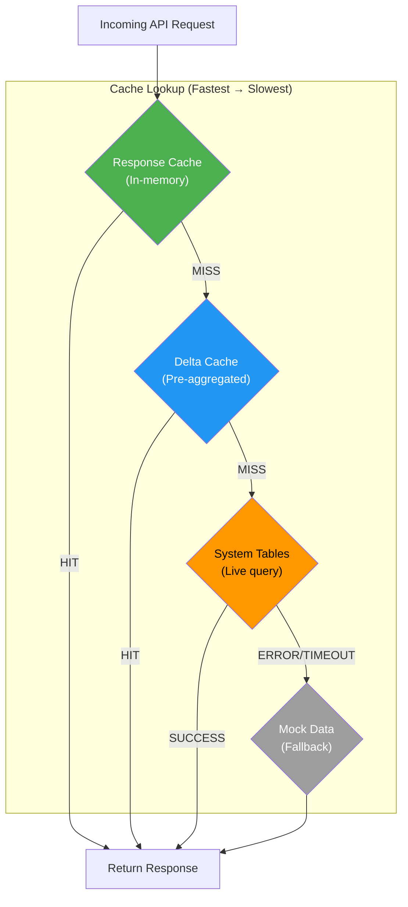
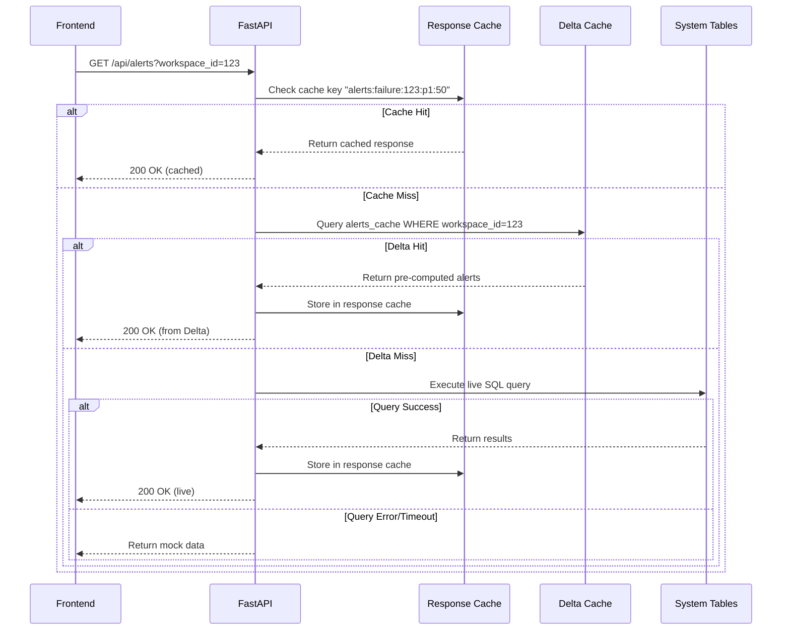
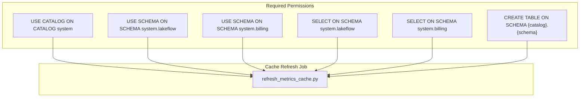
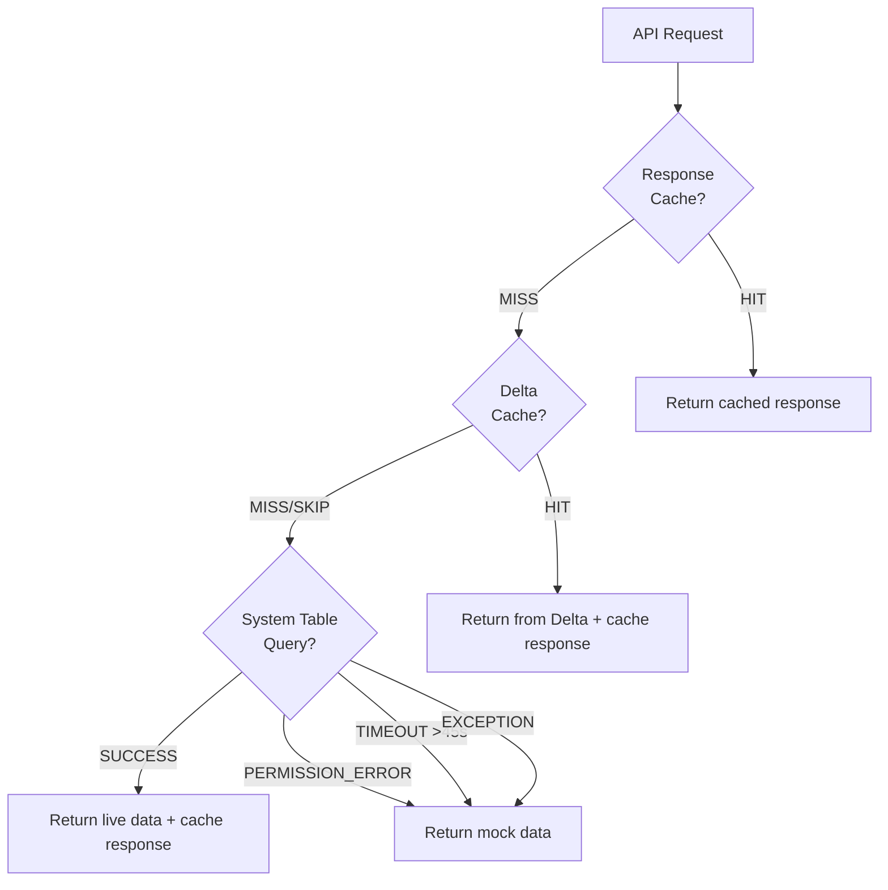

# Pipeline Documentation

**Version:** 1.3.2
**Last Updated:** March 2, 2026

This document describes the data pipelines that power the Databricks Job Monitor, including data flow, orchestration, caching strategies, and monitoring.

---

## Table of Contents

1. [Pipeline Overview](#pipeline-overview)
2. [Data Flow Architecture](#data-flow-architecture)
3. [Cache Refresh Pipeline](#cache-refresh-pipeline)
4. [API Request Flow](#api-request-flow)
5. [Caching Strategy](#caching-strategy)
6. [Orchestration](#orchestration)
7. [Error Handling](#error-handling)
8. [Monitoring & Alerting](#monitoring--alerting)
9. [Rollback Procedures](#rollback-procedures)

---

## Pipeline Overview

The Job Monitor uses a **multi-tier caching architecture** to provide fast dashboard loading while maintaining data freshness. Data flows from Unity Catalog system tables through pre-computed cache tables to the frontend via a FastAPI backend.

### Key Components

| Component | Technology | Purpose |
|-----------|------------|---------|
| Source Data | Unity Catalog System Tables | Real-time job runs, billing, job metadata |
| Cache Layer | Delta Tables | Pre-aggregated metrics for fast queries |
| API Backend | FastAPI + Databricks SDK | REST API with response caching |
| Frontend Cache | TanStack Query + IndexedDB | Client-side caching and persistence |
| UI | React + TanStack Router | Interactive dashboard |

---

## Data Flow Architecture



### Data Freshness by Layer

| Layer | Freshness | Latency |
|-------|-----------|---------|
| System Tables | Near real-time | 5-15 minutes |
| Delta Cache | Refreshed every 15 min | 15-30 minutes |
| Response Cache | TTL 60-600 seconds | Milliseconds |
| TanStack Query | TTL 1-30 minutes | Instant |
| IndexedDB | 24 hours max age | Instant |

---

## Cache Refresh Pipeline

The cache refresh pipeline pre-computes aggregations from system tables to enable fast dashboard loading.

### Pipeline: `refresh_metrics_cache.py`



### Job Configuration

| Setting | Value | Description |
|---------|-------|-------------|
| Job ID | `468386370679810` | E2 workspace |
| Schedule | `0 */15 * * * ?` | Every 15 minutes |
| Cluster | Serverless | Auto-scaling |
| Timeout | 30 minutes | Max execution time |

### Output Tables

```
{catalog}.{schema}.job_health_cache   -- ~4000+ rows
{catalog}.{schema}.cost_cache         -- ~2000+ rows
{catalog}.{schema}.alerts_cache       -- ~50-200 rows
```

### Processing Steps

1. **Ensure Schema Exists**
   ```python
   spark.sql(f"CREATE SCHEMA IF NOT EXISTS {catalog}.{schema}")
   ```

2. **Refresh Job Health Cache**
   - Aggregate runs by job_id (7-day and 30-day windows)
   - Compute success rates, priority flags
   - Detect consecutive failures using LAG window function
   - Calculate duration statistics (median, p90, avg, max)

3. **Refresh Cost Cache**
   - Aggregate DBU usage by job_id
   - Calculate week-over-week trends
   - Compute P90 baseline for anomaly detection
   - Build SKU breakdown strings

4. **Refresh Alerts Cache**
   - Generate failure alerts from health metrics
   - Generate cost spike alerts (>2x P90 baseline)
   - Include `workspace_id` for filtered queries

### Delta Write Options

```python
df.write.format("delta") \
    .mode("overwrite") \
    .option("overwriteSchema", "true") \  # Enable schema evolution
    .saveAsTable(table_name)
```

---

## API Request Flow

### Cache Hierarchy

The API backend uses a multi-tier cache lookup strategy:



### Cache TTLs by Endpoint

| Endpoint | Response Cache TTL | Delta Cache | Fallback |
|----------|-------------------|-------------|----------|
| `/api/health-metrics/summary` | 5 min | Yes | Mock |
| `/api/health-metrics` | 5 min | Yes | Mock |
| `/api/alerts` | 2 min | Yes (with workspace_id) | Mock |
| `/api/costs/summary` | 5 min | Yes | Mock |
| `/api/costs/anomalies` | 10 min | Yes | Mock |
| `/api/jobs/active` | 1 min | No (real-time) | Mock |
| `/api/historical/*` | 10 min | No | Mock |

### Request Processing Example: `/api/alerts`



---

## Caching Strategy

### Backend Response Cache

**Implementation:** In-memory dict with TTL-based expiration

```python
# response_cache.py
class ResponseCache:
    def __init__(self):
        self._cache: dict[str, tuple[Any, float]] = {}  # key -> (value, expires_at)

    def get(self, key: str) -> Any | None:
        if key in self._cache:
            value, expires_at = self._cache[key]
            if time.time() < expires_at:
                return value
            del self._cache[key]
        return None

    def set(self, key: str, value: Any, ttl_seconds: int):
        self._cache[key] = (value, time.time() + ttl_seconds)
```

### Frontend TanStack Query Presets

```typescript
// Cache presets by data volatility
export const queryPresets = {
    static:   { staleTime: Infinity, gcTime: 30min },   // Historical data
    semiLive: { staleTime: 5min,     gcTime: 15min },   // Health metrics
    slow:     { staleTime: 10min,    gcTime: 30min },   // Alerts, costs
    live:     { staleTime: 1min,     gcTime: 5min },    // Running jobs
    session:  { staleTime: 30min,    gcTime: 60min },   // User info
}
```

### IndexedDB Persistence

**Purpose:** Survive page refreshes for instant loading

**Implementation:**
```typescript
// Only persist successful queries with gcTime >= 5 minutes
const shouldDehydrateQuery = (query: Query) => {
    return query.state.status === 'success' &&  // Filter out pending (contain Promises)
           query.state.data !== undefined &&
           query.gcTime >= 5 * 60 * 1000;
};
```

**Constraints:**
- Max age: 24 hours
- Only `status === 'success'` queries (avoid Promise serialization errors)
- Queries with `gcTime >= 5 minutes` only

---

## Orchestration

### Job Schedule

The cache refresh job runs on a cron schedule configured in `config.yaml`:

```yaml
cache:
  catalog: job_monitor
  schema: cache
  refresh_cron: "0 */15 * * * ?"  # Every 15 minutes
```

### Dependencies



### Manual Trigger

```bash
# Trigger cache refresh manually
databricks jobs run-now 468386370679810 --profile DEFAULT
```

---

## Error Handling

### Cache Fallback Chain



### Error Types and Responses

| Error | Response | User Impact |
|-------|----------|-------------|
| Permission denied | Mock data | See sample data, no real metrics |
| Query timeout | Cached data or mock | May see stale data |
| Warehouse unavailable | 503 Service Unavailable | Error message |
| Invalid parameters | 422 Unprocessable Entity | Validation error |

### Retry Policy

- **System table queries:** No retry (use cache fallback)
- **Cache refresh job:** Databricks Job retry policy (configurable)
- **Frontend queries:** TanStack Query retry (3 attempts with backoff)

---

## Monitoring & Alerting

### Logging

All API operations are logged with structured context:

```python
logger.info(f"[CACHE_HIT] alerts: returning {len(cached_alerts)} alerts from cache")
logger.info(f"[CACHE_MISS] alerts: falling back to live query")
logger.info(f"[RESPONSE_CACHE] Cached alerts response ({len(alerts)}/{total} alerts)")
logger.warning(f"[TIMEOUT] alerts: live query timed out after 45s")
```

### Log Access

```bash
# View app logs
https://<app-url>/logz

# Or via CLI
databricks apps logs job-monitor --profile DEFAULT
```

### Key Metrics to Monitor

| Metric | Good | Warning | Critical |
|--------|------|---------|----------|
| Health metrics latency | <2s | 2-10s | >10s |
| Alerts latency | <2s | 2-5s | >5s |
| Cache hit rate | >80% | 50-80% | <50% |
| Cache refresh duration | <5min | 5-15min | >15min |

### Cache Staleness Check

```sql
-- Check cache freshness
SELECT
    'job_health_cache' as table_name,
    MAX(refreshed_at) as last_refresh,
    TIMESTAMPDIFF(MINUTE, MAX(refreshed_at), current_timestamp()) as minutes_ago
FROM job_monitor.cache.job_health_cache
UNION ALL
SELECT
    'alerts_cache',
    MAX(refreshed_at),
    TIMESTAMPDIFF(MINUTE, MAX(refreshed_at), current_timestamp())
FROM job_monitor.cache.alerts_cache
```

---

## Rollback Procedures

### Cache Table Issue

If cache tables are corrupted or contain bad data:

1. **Disable cache usage temporarily:**
   ```yaml
   # config.yaml
   use_cache: false
   ```

2. **Redeploy app:**
   ```bash
   ./deploy.sh e2
   ```

3. **Manually refresh cache:**
   ```bash
   databricks jobs run-now 468386370679810 --profile DEFAULT
   ```

4. **Re-enable cache and redeploy**

### Schema Evolution Issue

If schema changes break the cache:

1. **Drop and recreate tables:**
   ```sql
   DROP TABLE IF EXISTS job_monitor.cache.alerts_cache;
   ```

2. **Run cache refresh job** (will recreate tables)

3. **Verify schema:**
   ```sql
   DESCRIBE job_monitor.cache.alerts_cache;
   ```

### App Deployment Rollback

```bash
# List recent deployments
databricks apps list-deployments job-monitor --profile DEFAULT

# Rollback to previous version
databricks apps deploy job-monitor \
  --source-code-path /previous/version/path \
  --profile DEFAULT
```

---

## Performance Benchmarks

| Operation | Before Caching | After Caching | Improvement |
|-----------|---------------|---------------|-------------|
| Health metrics (full list) | 11-16s | <2s | 8x faster |
| Alerts (with workspace filter) | 46s | 1.3s | 35x faster |
| Costs summary | 30-40s | <3s | 10x faster |
| Active jobs | 200ms | 200ms | Real-time |

---

*Generated for Databricks Job Monitor v1.3.2*
