# Databricks Job Monitor - User Guide

**Version 1.3.2** | Last Updated: March 2, 2026

---

## Table of Contents

1. [Introduction](#introduction)
2. [Getting Started](#getting-started)
   - [Navigation](#navigation)
   - [Understanding the Layout](#understanding-the-layout)
3. [Dashboard](#dashboard)
   - [Metric Cards](#metric-cards)
   - [Recent Activity Panel](#recent-activity-panel)
   - [System Status Panel](#system-status-panel)
4. [Running Jobs](#running-jobs)
   - [State Summary Cards](#state-summary-cards)
   - [Running Jobs Table](#running-jobs-table)
   - [Recent Runs Indicator](#recent-runs-indicator)
   - [Streaming Job Detection](#streaming-job-detection)
5. [Job Health](#job-health)
   - [Time Window Selector](#time-window-selector)
   - [Priority Summary Cards](#priority-summary-cards)
   - [Job Health Table](#job-health-table)
   - [Priority System](#priority-system)
6. [Alerts](#alerts)
   - [Category Tabs](#category-tabs)
   - [Severity Badges](#severity-badges)
   - [Alert Table](#alert-table)
   - [Acknowledging Alerts](#acknowledging-alerts)
7. [Historical Trends](#historical-trends)
   - [Summary Cards](#summary-cards)
   - [Trend Tabs](#trend-tabs)
   - [Chart Features](#chart-features)
8. [Global Filters](#global-filters)
   - [Filter Bar](#filter-bar)
   - [Workspace Filter](#workspace-filter)
   - [Team Filter](#team-filter)
   - [Job Name Patterns](#job-name-patterns)
   - [Time Range Picker](#time-range-picker)
9. [Filter Presets](#filter-presets)
   - [Creating Presets](#creating-presets)
   - [Editing Presets](#editing-presets)
   - [Deleting Presets](#deleting-presets)
10. [Data Freshness & Performance](#data-freshness--performance)
11. [Keyboard Shortcuts](#keyboard-shortcuts)
12. [Troubleshooting](#troubleshooting)
13. [Appendix: Visual Reference](#appendix-visual-reference)
    - [Page Screenshots](#page-screenshots)
    - [Annotated Screenshots](#annotated-screenshots)
    - [UI States](#ui-states)

---

## Introduction

### Purpose

Databricks Job Monitor is an operational monitoring dashboard designed for **data engineers**, **platform teams**, and **DevOps engineers** who manage Databricks workloads. It provides a centralized view to:

- **Monitor job health** across your entire Databricks workspace
- **Track running jobs** in real-time with streaming job detection
- **Identify problematic jobs** using an intelligent priority system (P1/P2/P3)
- **Receive proactive alerts** for failures, SLA breaches, cost anomalies, and cluster issues
- **Analyze historical trends** with period-over-period comparison
- **Control costs** by monitoring DBU consumption per job and team

### Target Audience

| Role | Primary Use Cases |
|------|------------------|
| **Data Engineers** | Monitor job success rates, investigate failures, track SLA compliance |
| **Platform Teams** | Oversee workspace health, identify cost anomalies, manage cluster efficiency |
| **DevOps Engineers** | Real-time job monitoring, incident response, capacity planning |
| **Team Leads** | Team-level cost attribution, job health dashboards, trend analysis |

### Key Benefits

- **Single pane of glass** for all job monitoring needs
- **Proactive alerting** before issues escalate
- **Cost visibility** with team-level attribution
- **Fast navigation** with optimized caching and prefetching
- **Mobile-friendly** responsive design

---

## Getting Started

### Navigation

The application uses a **sidebar navigation** system with five main pages:

| Icon | Page | Description |
|------|------|-------------|
|  | **Dashboard** | Overview with summary metrics and recent activity |
|  | **Running Jobs** | Real-time view of currently executing jobs |
|  | **Job Health** | Health metrics with priority-based sorting |
|  | **Alerts** | Active alerts from all categories |
|  | **Historical** | Trend charts for costs, success rates, failures |

**Mobile Navigation**: On smaller screens, tap the hamburger menu (three horizontal lines) to open the navigation drawer.

### Understanding the Layout

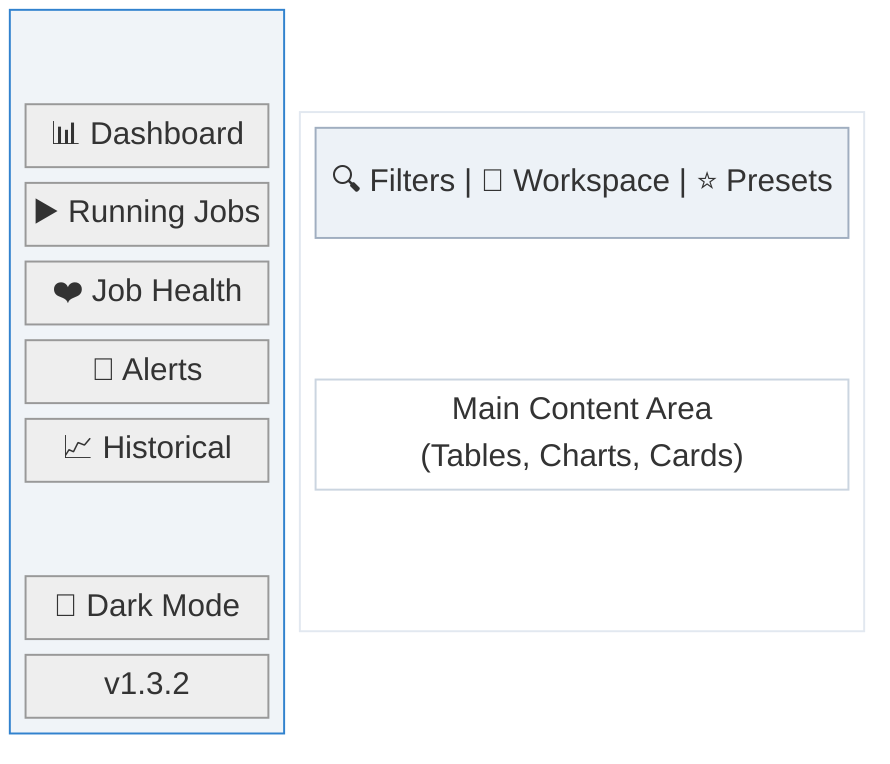

**Components:**
- **Sidebar** (left): Navigation links, dark mode toggle, version info, workspace name
- **Filter Bar** (top): Collapsible global filters that apply across all pages
- **Main Content** (center): Page-specific content with responsive layout

---

## Dashboard

**Purpose**: Provide a high-level overview of your Databricks jobs ecosystem at a glance.

**Data Source**: `/api/health-metrics/summary`, `/api/alerts`, `/api/costs/summary`

**Update Frequency**: Semi-live (5 minutes) for health metrics, slow (10 minutes) for alerts/costs


<details>
<summary><strong>View Annotated Screenshot</strong> (with numbered callouts)</summary>

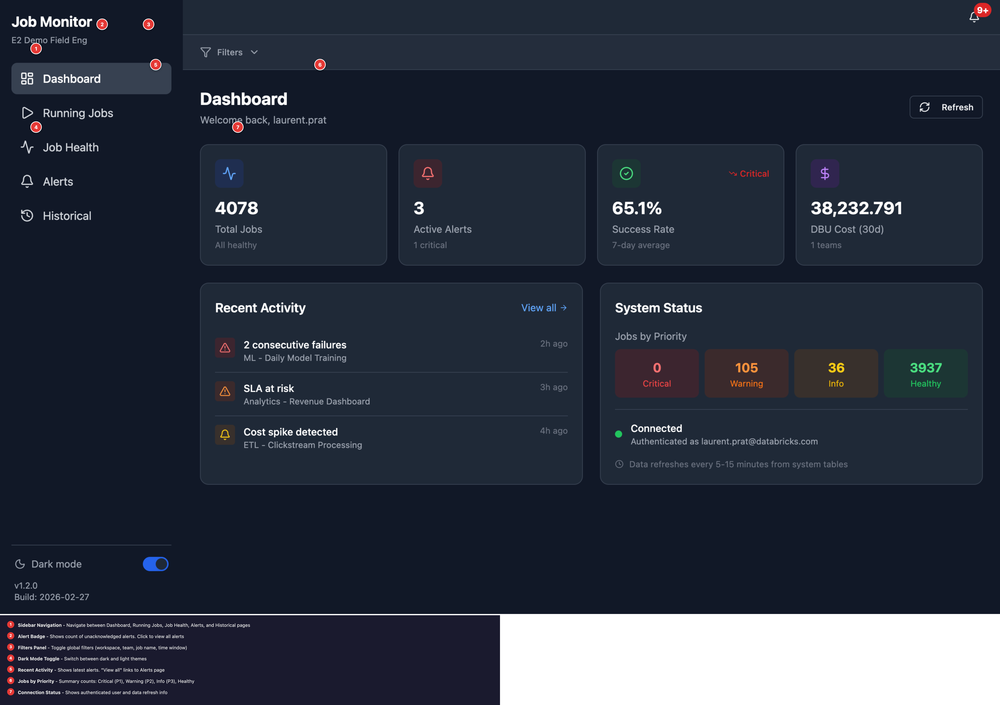

**Callouts:**
1. **Sidebar Navigation** - Navigate between Dashboard, Running Jobs, Job Health, Alerts, and Historical pages
2. **Alert Badge** - Shows count of unacknowledged alerts. Click to view all alerts
3. **Filters Panel** - Toggle global filters (workspace, team, job name, time window)
4. **Dark Mode Toggle** - Switch between dark and light themes
5. **Recent Activity** - Shows latest alerts. "View all" links to Alerts page
6. **Jobs by Priority** - Summary counts: Critical (P1), Warning (P2), Info (P3), Healthy
7. **Connection Status** - Shows authenticated user and data refresh info

</details>

### Metric Cards

Four summary cards at the top of the dashboard:

#### Total Jobs Card
| Property | Details |
|----------|---------|
| **Purpose** | Shows count of jobs with activity in the monitoring window |
| **Value** | Number of unique jobs |
| **Subtitle** | Count of critical (P1) jobs, or "All healthy" if none |
| **Click Action** | Navigates to Job Health page |
| **States** | Loading (skeleton), Populated |

#### Active Alerts Card
| Property | Details |
|----------|---------|
| **Purpose** | Current alert count requiring attention |
| **Value** | Total number of active alerts |
| **Subtitle** | Count of critical alerts, or "No critical alerts" |
| **Icon Color** | Red if alerts > 0, Green if no alerts |
| **Click Action** | Navigates to Alerts page |

#### Success Rate Card
| Property | Details |
|----------|---------|
| **Purpose** | Average job success rate over last 7 days |
| **Value** | Percentage (e.g., "94.5%") |
| **Subtitle** | "7-day average" |
| **Trend Indicator** | "Healthy" (green, >= 95%), "Warning" (neutral, 80-94%), "Critical" (red, < 80%) |

#### DBU Cost Card
| Property | Details |
|----------|---------|
| **Purpose** | Total DBU consumption over last 30 days |
| **Value** | Formatted number (e.g., "12,345") |
| **Subtitle** | Number of teams contributing to cost |
| **Click Action** | Navigates to Historical page |

### Recent Activity Panel

| Property | Details |
|----------|---------|
| **Purpose** | Show the 5 most recent alerts for quick awareness |
| **Location** | Left side of two-column layout |
| **Data Source** | `/api/alerts` (first 5 results) |
| **Item Display** | Severity icon, alert title, job name/category, time ago |
| **Empty State** | Green checkmark with "All systems healthy" message |
| **Click Action** | "View all" link navigates to Alerts page |

**Severity Icons:**
- P1 (Critical): Red triangle with exclamation
- P2 (Warning): Orange triangle with exclamation
- P3 (Info): Yellow bell

### System Status Panel

| Property | Details |
|----------|---------|
| **Purpose** | Show job distribution by priority and authentication status |
| **Location** | Right side of two-column layout |

**Jobs by Priority Section:**
Four colored boxes showing counts:
- **Critical** (Red): P1 jobs with consecutive failures
- **Warning** (Orange): P2 jobs with recent failure
- **Info** (Yellow): P3 jobs with success rate 70-89%
- **Healthy** (Green): Jobs with >= 90% success rate

**Connection Status Section:**
- Green dot + "Connected" + authenticated email (when using OBO)
- Yellow dot + "Local Development" (when running locally without OAuth)

**Data Freshness Footer:**
"Data refreshes every 5-15 minutes from system tables"

---

## Running Jobs

**Purpose**: Monitor jobs that are currently executing in real-time.

**Data Source**: `/api/jobs-api/active` (Databricks Jobs API)

**Update Frequency**: Live (auto-refresh every 30 seconds)

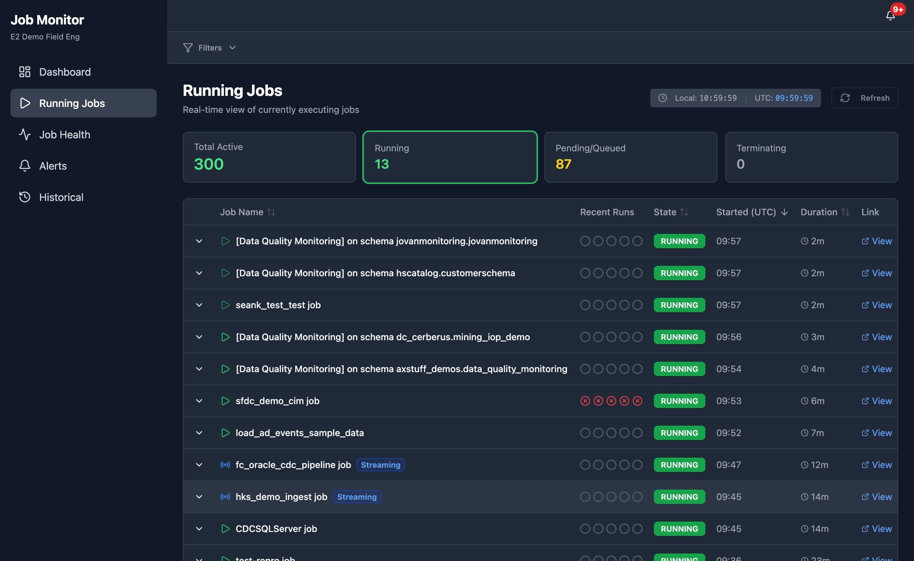

<details>
<summary><strong>View Annotated Screenshot</strong> (with numbered callouts)</summary>

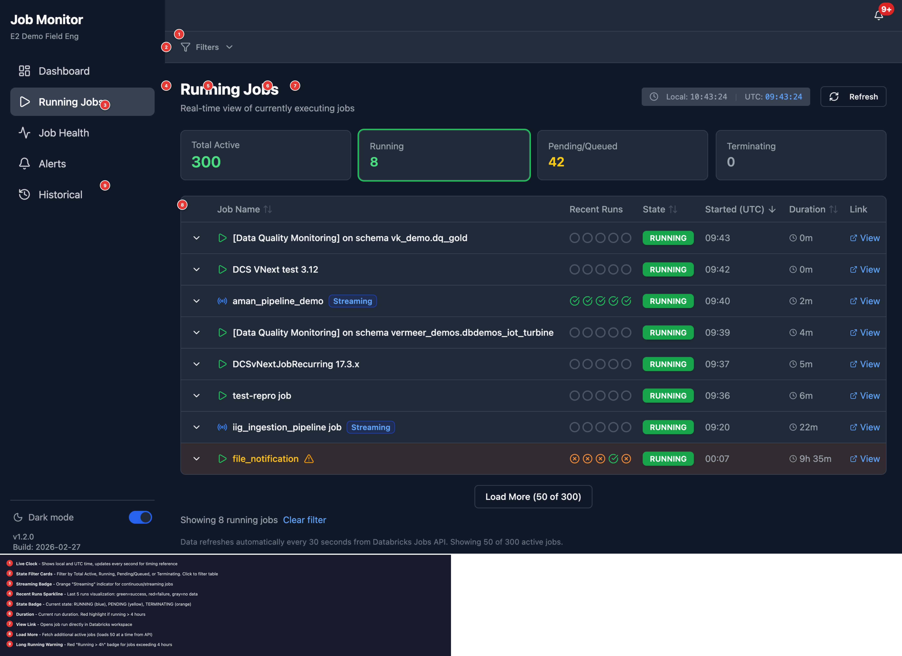

**Callouts:**
1. **Live Clock** - Shows local and UTC time, updates every second for timing reference
2. **State Filter Cards** - Filter by Total Active, Running, Pending/Queued, or Terminating
3. **Streaming Badge** - Orange "Streaming" indicator for continuous/streaming jobs
4. **Recent Runs Sparkline** - Last 5 runs with hover tooltips showing start/end time and duration
5. **State Badge** - Current state: RUNNING (blue), PENDING (yellow), TERMINATING (orange)
6. **Duration** - Current run duration. Red highlight if running > 4 hours
7. **View Link** - Opens job run directly in Databricks workspace
8. **Load More** - Fetch additional active jobs (loads 50 at a time)
9. **Long Running Warning** - Red "Running > 4h" badge for jobs exceeding 4 hours

</details>

### State Summary Cards

Four clickable cards for filtering by job state:

| Card | Description | Click Action |
|------|-------------|--------------|
| **Total Active** | All running, pending, queued, and terminating jobs | Show all (clear filter) |
| **Running** | Jobs actively executing | Filter to RUNNING only |
| **Pending/Queued** | Jobs waiting to start | Filter to PENDING/QUEUED |
| **Terminating** | Jobs in shutdown process | Filter to TERMINATING |

**Visual Feedback**: Selected card has a colored ring border matching the state color.

### Running Jobs Table

| Column | Description |
|--------|-------------|
| **Expand** | Chevron button to show expanded job details |
| **Job Name** | Job name with streaming/long-running indicators |
| **Recent Runs** | Last 5 run results as status icons |
| **State** | Badge showing RUNNING, PENDING, QUEUED, or TERMINATING |
| **Started (UTC)** | Start time in UTC for consistency with Databricks |
| **Duration** | Time since job started (e.g., "2h 15m") |
| **Link** | External link to job run in Databricks UI |

**Table Features:**
- Click any row to expand and see detailed job information
- Sortable columns: Job Name, State, Started, Duration
- Amber background highlight for long-running jobs
- Click column header to sort (toggle asc/desc)

### Recent Runs Indicator

Displays the last 5 completed runs as small icons (sparkline). This data is fetched from Unity Catalog system tables (`system.lakeflow.job_run_timeline`) and may take a moment to load after the page opens.

| Icon | Meaning |
|------|---------|
| Green checkmark | SUCCEEDED |
| Red X | FAILED or ERROR |
| Orange X | CANCELLED |
| Gray minus | SKIPPED |
| Empty gray circle | No historical data available |

**Hover Tooltips**: Hover over any sparkline icon to see detailed run information:
- **Status**: Success, Failed, Error, or Cancelled
- **Start Time**: When the run started (e.g., "28 Feb, 12:10")
- **End Time**: When the run completed (e.g., "28 Feb, 12:12")
- **Duration**: Total run time (e.g., "1m 34s" or "42m 1s")

Example tooltip: `"Failed Start: 28 Feb, 11:47 End: 28 Feb, 12:29 Duration: 42m 1s"`

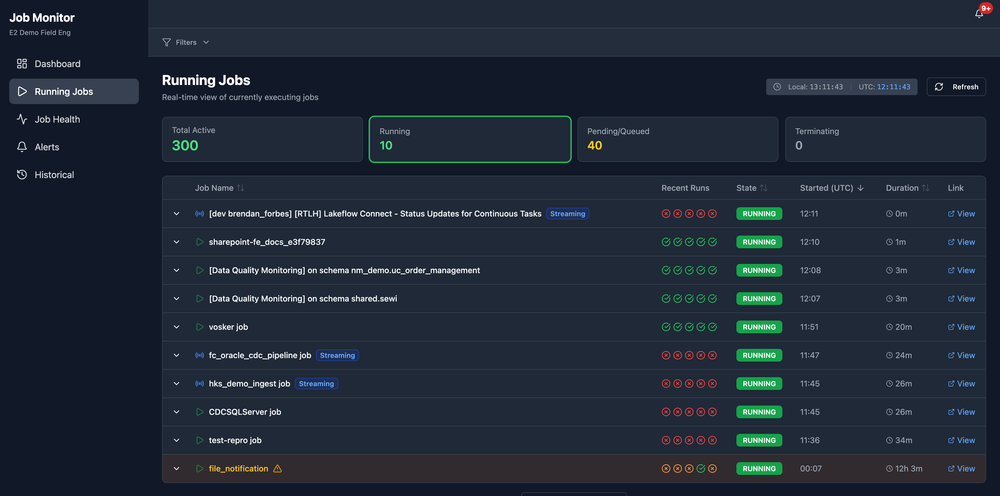

**Note**: Empty circles indicate that no historical run data exists for that job in the system tables. This is common for:
- Newly created jobs that haven't completed a run yet
- Jobs that haven't run within the selected time window
- Jobs where system table data hasn't synced yet (5-15 minute latency)

### Streaming Job Detection

Jobs are automatically detected as "streaming" based on name patterns:
- Contains: `stream`, `cdc`, `continuous`, `realtime`, `kafka`, `kinesis`, `eventhub`, `ingest`, `pipeline`

**Streaming Job Indicators:**
- Radio icon instead of play icon
- "Streaming" badge next to job name
- Different long-running threshold (24h instead of 4h)

**Long-Running Alerts:**
- Batch jobs: Warning icon if running > 4 hours
- Streaming jobs: Warning icon if running > 24 hours
- Row highlighted with amber background

### Time Clock

Located in the page header, shows both local and UTC time:
```
Local: 14:32:15 | UTC: 21:32:15
```

---

## Job Health

**Purpose**: Analyze job health patterns and identify problematic jobs that need attention.

**Data Source**: `/api/health-metrics` (Unity Catalog system tables)

**Update Frequency**: Semi-live (5 minutes)

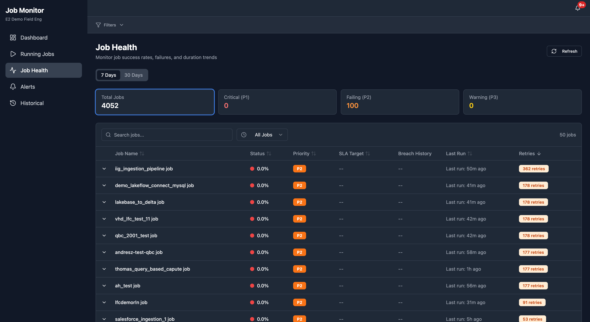

<details>
<summary><strong>View Annotated Screenshot</strong> (with numbered callouts)</summary>

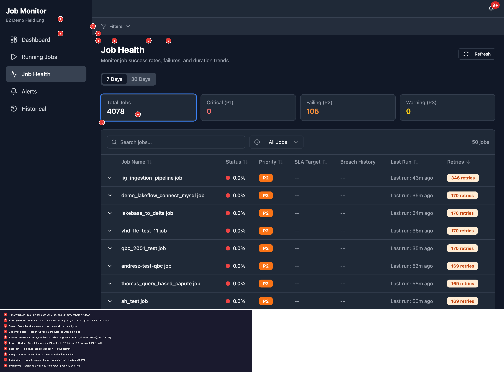

**Callouts:**
1. **Time Window Tabs** - Switch between 7-day and 30-day analysis windows
2. **Priority Filters** - Filter by Total, Critical (P1), Failing (P2), or Warning (P3)
3. **Search Box** - Real-time search by job name within loaded jobs
4. **Job Type Filter** - Filter by All Jobs, Scheduled, or Streaming jobs
5. **Success Rate** - Percentage with color: green (>95%), yellow (80-95%), red (<80%)
6. **Priority Badge** - Calculated priority: P1 (critical), P2 (failing), P3 (warning), P4 (healthy)
7. **Last Run** - Time since last job execution (relative format)
8. **Retry Count** - Number of retry attempts in the time window
9. **Pagination** - Navigate pages, change rows per page (10/25/50/100/All)
10. **Load More** - Fetch additional jobs from server (loads 50 at a time)

</details>

### Time Window Selector

Toggle between two analysis windows:

| Option | Description |
|--------|-------------|
| **7 Days** | Recent health snapshot (default) - faster query |
| **30 Days** | Extended view for trend analysis |

### Priority Summary Cards

Four clickable cards for filtering by priority:

| Card | Color | Description | Click Action |
|------|-------|-------------|--------------|
| **Total Jobs** | Blue | All jobs in window | Show all |
| **Critical (P1)** | Red | Jobs with 2+ consecutive failures | Filter to P1 |
| **Failing (P2)** | Orange | Jobs with recent failure | Filter to P2 |
| **Warning (P3)** | Yellow | Jobs with 70-89% success rate | Filter to P3 |

**Visual Feedback**: Selected card has a colored ring border.

### Job Health Table

| Column | Description |
|--------|-------------|
| **Expand** | Chevron to show detailed job information |
| **Priority** | P1/P2/P3 badge or green checkmark for healthy |
| **Job Name** | Name with alert indicator if alerts exist |
| **Success Rate** | Percentage with color coding |
| **Runs** | Total runs in the time window |
| **Failures** | Count of failed runs |
| **Avg Duration** | Average run duration |
| **SLA Target** | Editable SLA target (click to edit) |

**Table Features:**
- Pagination with "Load More" for large datasets
- Search box to filter by job name
- Sortable columns
- Expandable rows with detailed metrics
- Virtualized rendering for 100+ rows (performance optimization)

### Priority System

Jobs are classified into priorities based on failure patterns:

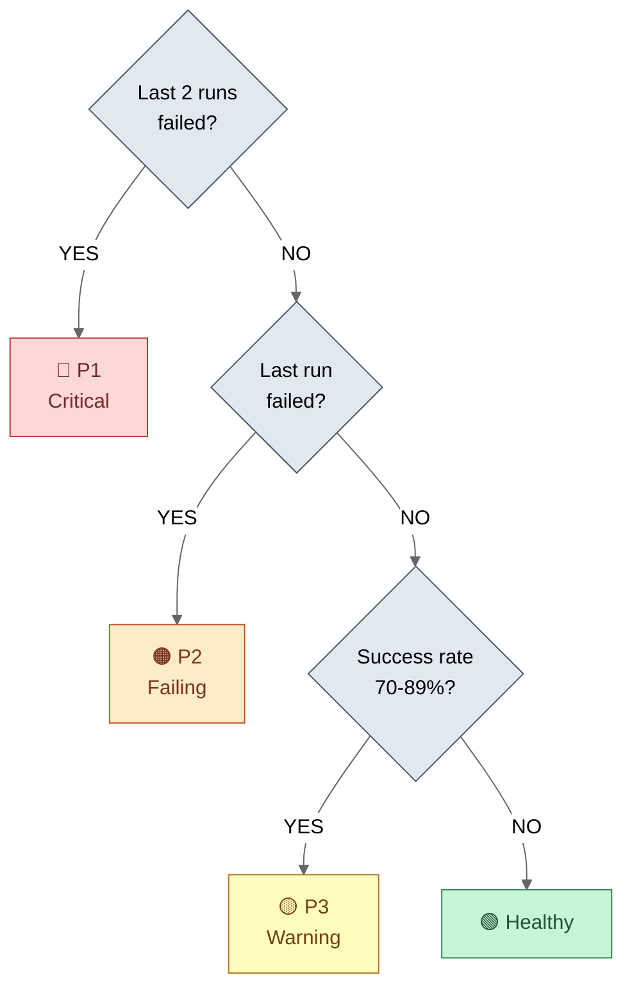

| Priority | Criteria | Recommended Action |
|----------|----------|-------------------|
| **P1 (Critical)** | 2+ consecutive failures | Immediate investigation required |
| **P2 (Failing)** | Most recent run failed | Review job logs, may be transient |
| **P3 (Warning)** | Success rate 70-89% | Monitor closely, consider optimization |
| **Healthy** | Success rate >= 90% | No action needed |

---

## Alerts

**Purpose**: Review and manage alerts from multiple detection sources.

**Data Source**: `/api/alerts` (multiple queries for each category)

**Update Frequency**: Slow (10 minutes) - expensive query

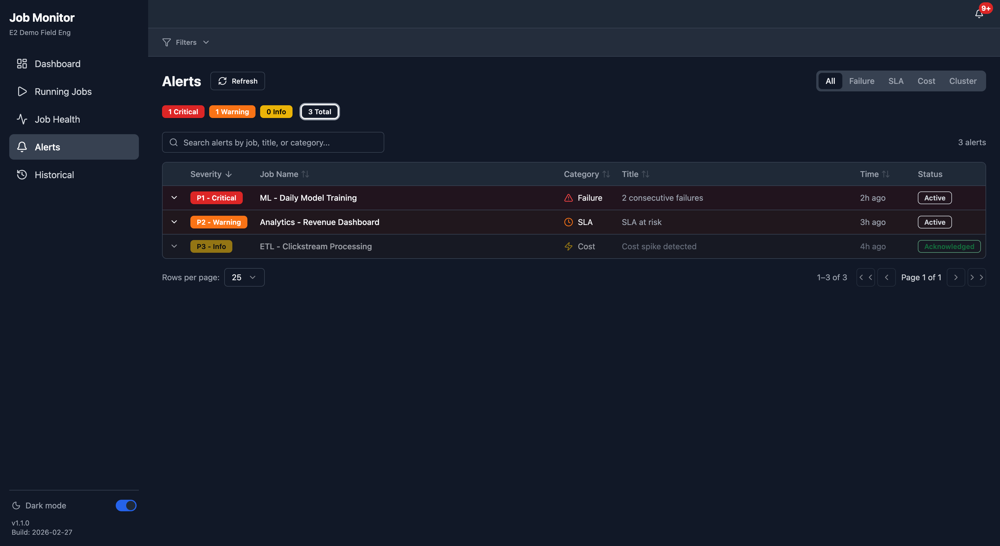

<details>
<summary><strong>View Annotated Screenshot</strong> (with numbered callouts)</summary>

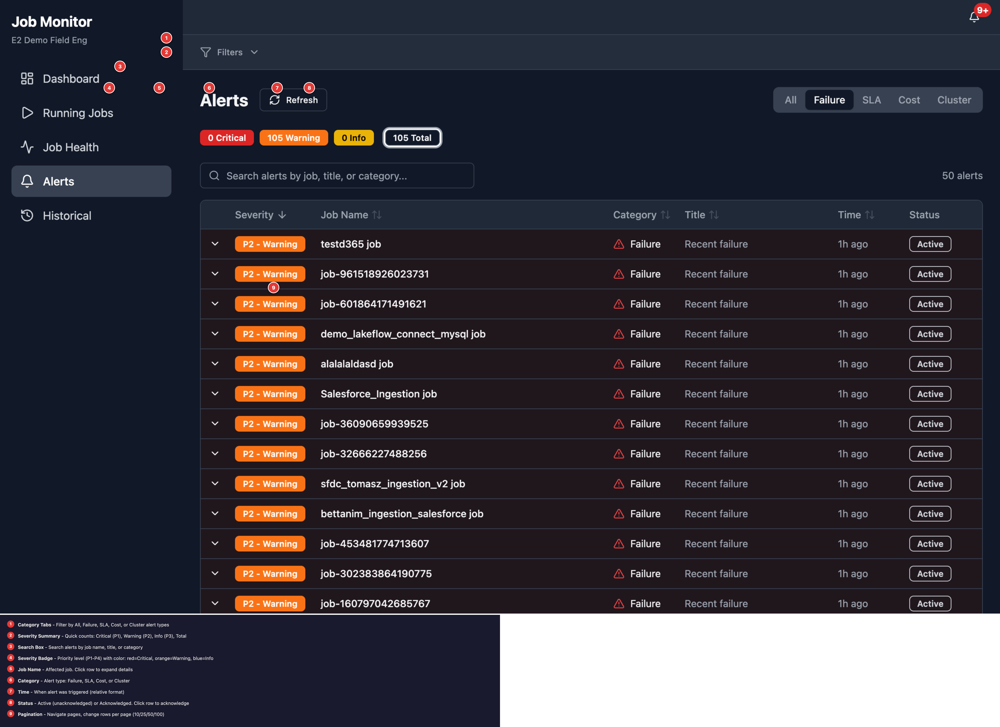

**Callouts:**
1. **Category Tabs** - Filter by All, Failure, SLA, Cost, or Cluster alert types
2. **Severity Summary** - Quick counts: Critical (P1), Warning (P2), Info (P3), Total
3. **Search Box** - Search alerts by job name, title, or category
4. **Severity Badge** - Priority level (P1-P4) with color: red=Critical, orange=Warning, blue=Info
5. **Job Name** - Affected job. Click row to expand details
6. **Category** - Alert type: Failure, SLA, Cost, or Cluster
7. **Time** - When alert was triggered (relative format)
8. **Status** - Active (unacknowledged) or Acknowledged. Click row to acknowledge
9. **Pagination** - Navigate pages, change rows per page (10/25/50/100)

</details>

### Category Tabs

Filter alerts by source category:

| Tab | Data Source | Query Time |
|-----|-------------|------------|
| **All** | All 4 categories combined | ~30 seconds |
| **Failure** | Job run results | ~1-5 seconds (default) |
| **SLA** | Duration vs target | ~1 second (Jobs API only) |
| **Cost** | DBU usage anomalies | ~10-15 seconds |
| **Cluster** | Cluster metrics | ~10-15 seconds |

**Performance Tip**: The page defaults to "Failure" tab because it's the fastest query. Use specific category tabs instead of "All" for faster loading.

### Severity Badges

Clickable badges showing counts by severity:

| Badge | Color | Description | Click Action |
|-------|-------|-------------|--------------|
| **Critical** | Red | Requires immediate attention | Filter to P1 |
| **Warning** | Orange | Should be investigated | Filter to P2 |
| **Info** | Yellow | Informational, may need attention | Filter to P3 |
| **Total** | Gray | All alerts | Clear filter |

### Alert Table

| Column | Description |
|--------|-------------|
| **Severity** | P1/P2/P3 badge with color |
| **Category** | failure, sla, cost, or cluster |
| **Title** | Alert description |
| **Job Name** | Affected job (if applicable) |
| **Created** | When alert was generated |
| **Actions** | Acknowledge button |

### Acknowledging Alerts

| Action | Effect |
|--------|--------|
| **Click "Acknowledge"** | Alert is dismissed for 24 hours |
| **Auto-expire** | Acknowledgment expires after 24h, alert reappears if still active |

**Note**: Acknowledging an alert does not fix the underlying issue - it only hides the alert temporarily.

---

## Historical Trends

**Purpose**: Visualize trends over time with period-over-period comparison.

**Data Source**: `/api/historical/costs`, `/api/historical/success-rate`, `/api/historical/sla-breaches`

**Update Frequency**: Static (historical data never changes)

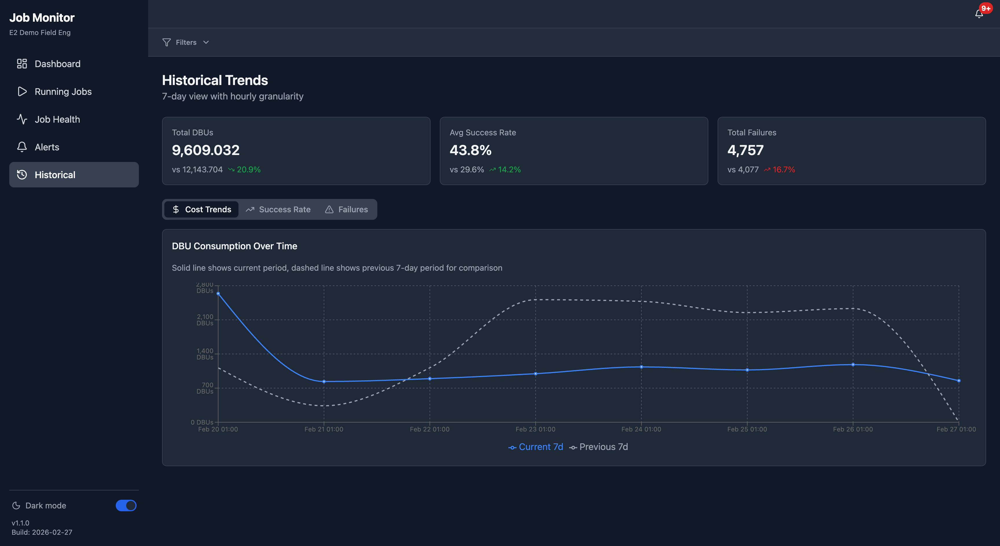

### Summary Cards

Three metric cards showing current vs previous period:

| Card | Metric | Comparison |
|------|--------|------------|
| **Total DBUs** | DBU consumption | vs previous period (lower is better) |
| **Avg Success Rate** | Success percentage | vs previous period (higher is better) |
| **Total Failures** | Failed run count | vs previous period (lower is better) |

**Trend Indicators:**
- Green up arrow: Positive change (good)
- Red down arrow: Negative change (bad)
- Gray dash: Minimal change (< 0.5%)

### Trend Tabs

| Tab | Chart Content | Color |
|-----|---------------|-------|
| **Cost Trends** | DBU consumption over time | Blue |
| **Success Rate** | Job success percentage | Green |
| **Failures** | Failed run count | Red |

**Lazy Loading**: Data for each tab is only fetched when the tab is selected, reducing initial page load from 3 API calls to 1.

### Chart Features

| Feature | Description |
|---------|-------------|
| **Solid Line** | Current period data |
| **Dashed Line** | Previous period (same duration) for comparison |
| **Hover Tooltip** | Exact values at each data point |
| **Auto Granularity** | Hourly for 7d, Daily for 30d, Weekly for 90d |
| **Responsive** | Charts resize for mobile screens |

---

## Global Filters

**Purpose**: Apply filters across all pages from a single location.

**Location**: Collapsible bar below the header, above main content.

### Filter Bar

| State | Description |
|-------|-------------|
| **Collapsed** | Shows "Filters" button with badge count of active filters |
| **Expanded** | Shows all filter options in a horizontal row |

**Active Filter Badge**: Number showing count of active filters (excluding defaults).

### Workspace Filter

| Option | Description |
|--------|-------------|
| **Current Workspace** | Filter to current workspace only (default) |
| **All Workspaces** | Show data from all accessible workspaces |

**Icon**: Globe icon indicates workspace-level filter.

### Team Filter

| Option | Description |
|--------|-------------|
| **All Teams** | Show all jobs regardless of team tag (default) |
| **Specific Team** | Filter to jobs tagged with selected team |

**Note**: Teams are derived from job tags (`team` tag key). Jobs without team tags appear as "Untagged".

### Job Name Patterns

**Purpose**: Filter jobs using wildcard patterns for flexible matching.

| Pattern | Matches |
|---------|---------|
| `*ETL*` | Any job containing "ETL" |
| `prod-*` | Jobs starting with "prod-" |
| `*-daily` | Jobs ending with "-daily" |
| `*DQ*,*quality*` | Multiple patterns (comma-separated) |

**Input Behavior:**
- Type pattern and press Enter to add
- Multiple patterns are combined with OR logic
- Click X on pattern chip to remove
- Patterns apply to all pages

### Time Range Picker

| Option | Description |
|--------|-------------|
| **7d** | Last 7 days (default) |
| **30d** | Last 30 days |
| **90d** | Last 90 days |
| **Custom** | Select specific start and end dates |

**Custom Date Range**: Opens a calendar popover for date selection.

---

## Filter Presets

**Purpose**: Save and recall filter combinations for quick access.

### Creating Presets

1. Set your desired filters using the filter bar
2. Click the **+** button next to the Presets dropdown
3. Enter a descriptive name (e.g., "My Team Last 7d")
4. Click **Save Preset**

### Editing Presets

1. Click the **Presets** dropdown
2. Click the **pencil icon** next to a preset
3. The preset's filters are loaded and editing mode activates
4. Modify any filters as needed
5. Click the **checkmark button** to open save dialog
6. Confirm the name and click **Update Preset**

**Editing Mode Indicator**: Blue badge shows "Editing: [preset name]" when in edit mode.

### Deleting Presets

1. Click the **Presets** dropdown
2. Click the **trash icon** next to a preset
3. Preset is immediately deleted (no confirmation)

---

## Data Freshness & Performance

### Data Sources and Latency

| Data Type | Source | Latency | Cache Duration |
|-----------|--------|---------|----------------|
| Running Jobs | Jobs API | Real-time | 30 seconds |
| Job Health | System Tables | 5-15 minutes | 5 minutes |
| Alerts | Multiple sources | 5-15 minutes | 10 minutes |
| Costs | System Tables | 5-15 minutes | 10 minutes |
| Historical | System Tables | 5-15 minutes | Infinite (static) |

### Cache Strategy

The application uses TanStack Query with tiered caching:

| Preset | Stale Time | Use Case |
|--------|------------|----------|
| **Live** | 10 seconds | Running jobs |
| **Semi-Live** | 5 minutes | Job health, filters |
| **Slow** | 10 minutes | Alerts, costs |
| **Static** | Infinite | Historical data |
| **Session** | 30 minutes | User info |

**IndexedDB Persistence** (v1.3+): Query results with cache times >= 5 minutes are persisted to IndexedDB and survive page refreshes. This means:
- Dashboard loads instantly on return visits
- Alerts and health data appear immediately from cache
- Background refresh updates stale data automatically
- Cache expires after 24 hours

### Performance Tips

1. **Use category tabs on Alerts page** - Individual categories are 5-30x faster than "All"
2. **Pagination** - Large tables use "Load More" to reduce initial load
3. **Route Prefetching** - Adjacent pages are preloaded for instant navigation
4. **Table Virtualization** - Only visible rows are rendered for 100+ job tables
5. **Workspace Filter** - Alerts with workspace filter now load in ~1.3s (was 46s)

---

## Keyboard Shortcuts

| Shortcut | Action |
|----------|--------|
| `Esc` | Close expanded rows/dialogs |
| `Enter` | Submit filter patterns |

---

## Troubleshooting

### Dashboard Shows 0 or Loading

**Symptoms**: Metric cards show 0 or stuck in loading state

**Solutions**:
1. Check browser console for errors (F12 > Console)
2. Verify you're authenticated (check Connection Status panel)
3. Try the Refresh button
4. Clear browser cache and reload

### Slow Page Loads (> 10 seconds)

**Symptoms**: Pages take 10-30+ seconds to load

**Solutions**:
1. On Alerts page, use specific category tabs instead of "All"
2. Check if filters are too broad (try narrowing team/time range)
3. Reduce time window from 30d to 7d

### Permission Errors

**Symptoms**: "INSUFFICIENT_PERMISSIONS" error messages

**Solutions**:
1. Ensure you have access to Unity Catalog system tables
2. Contact your workspace administrator for system table grants
3. Verify OBO authentication is enabled (check app logs)

### Data Not Updating

**Symptoms**: Data appears stale despite refreshing

**Solutions**:
1. Check the data freshness note at bottom of each page
2. System tables have 5-15 minute latency - this is normal
3. Force refresh by clicking the Refresh button
4. Hard refresh browser (Ctrl+Shift+R / Cmd+Shift+R)

### Mobile Navigation Issues

**Symptoms**: Can't access navigation on mobile

**Solutions**:
1. Tap the hamburger menu icon (three lines) in top-left
2. If menu doesn't open, try rotating device
3. Ensure JavaScript is enabled in browser

---

## Getting Help

- **In-app**: Check the data freshness notes at the bottom of each page
- **Logs**: Access app logs at `https://[APP_URL]/logz`
- **Issues**: Report bugs at the project repository

---

## Appendix: Visual Reference

### Page Screenshots

| Page | Screenshot | Description |
|------|------------|-------------|
| Dashboard |  | Overview with metrics and alerts |
| Running Jobs |  | Real-time active jobs |
| Job Health |  | Priority-sorted health table |
| Alerts |  | Alert management interface |
| Historical |  | Trend charts and analysis |

### Annotated Screenshots

These screenshots include numbered callouts explaining each UI element:

| Page | Annotated Screenshot |
|------|---------------------|
| Dashboard | [dashboard-annotated.png](screenshots/dashboard-annotated.png) |
| Running Jobs | [running-jobs-annotated.png](screenshots/running-jobs-annotated.png) |
| Job Health | [job-health-annotated.png](screenshots/job-health-annotated.png) |
| Alerts | [alerts-annotated.png](screenshots/alerts-annotated.png) |

### UI States

#### Empty States
When filters return no results, helpful messages guide the user:

| State | Screenshot | Message |
|-------|------------|---------|
| No Running Jobs | 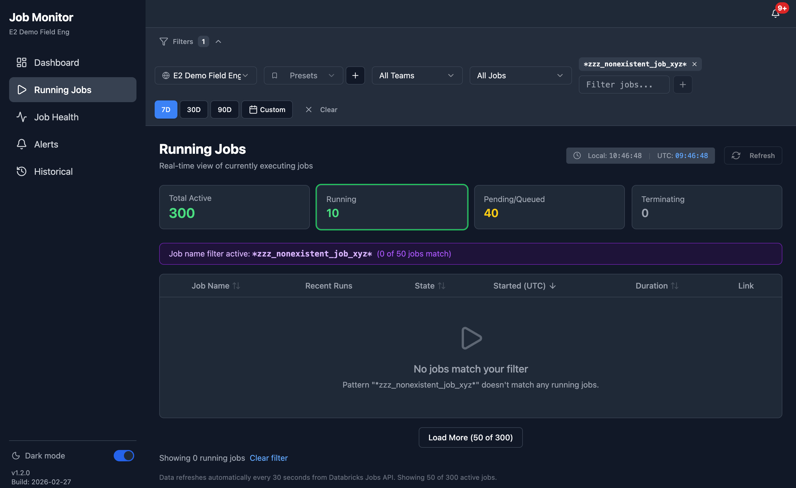 | "No jobs match your filter" |
| No Job Health Data | 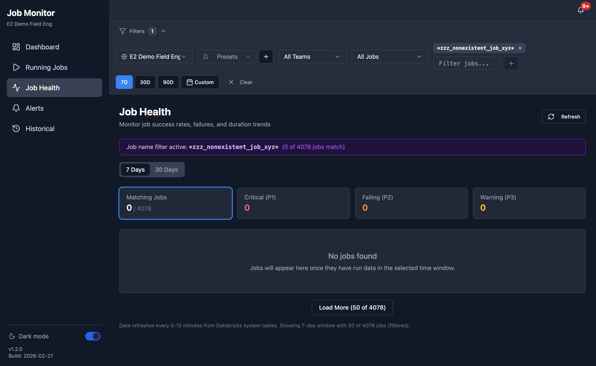 | "No jobs found" |

#### Loading States
Data-heavy pages show loading indicators while fetching:

| State | Screenshot |
|-------|------------|
| Historical Loading | 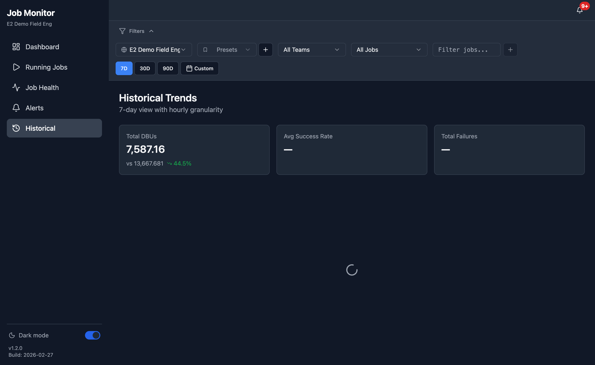 |
| Job Health Loading | 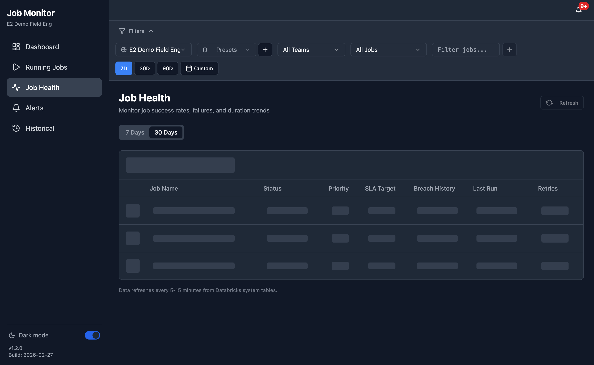 |

---

## Related Documentation

| Document | Description |
|----------|-------------|
| [README.md](../README.md) | Project overview and quick start |
| [DEVELOPER.md](../DEVELOPER.md) | Developer guide for local setup |
| [CHANGELOG.md](../CHANGELOG.md) | Version history and release notes |
| [DATA_DICTIONARY.md](DATA_DICTIONARY.md) | Schema documentation for all tables |
| [PIPELINE.md](PIPELINE.md) | Data flow architecture and caching |
| [TESTING_GUIDE.md](TESTING_GUIDE.md) | Testing strategies and coverage |

---

*This guide was generated for Databricks Job Monitor v1.3.2*
